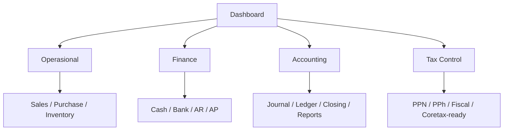
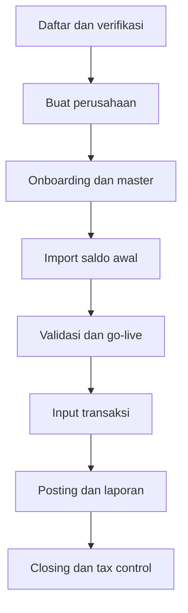
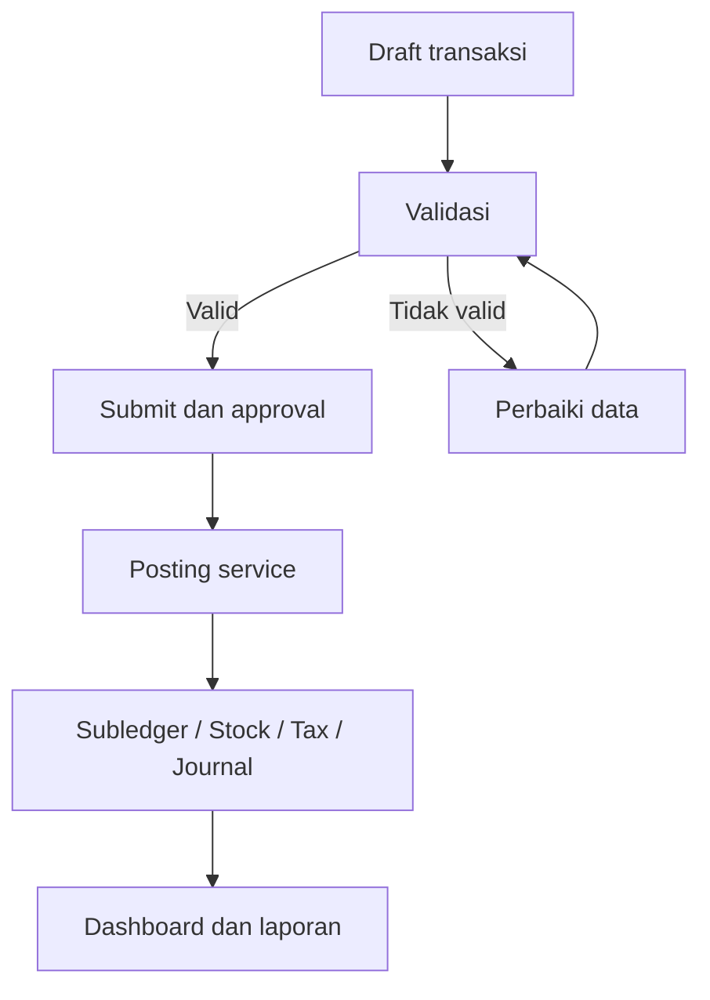
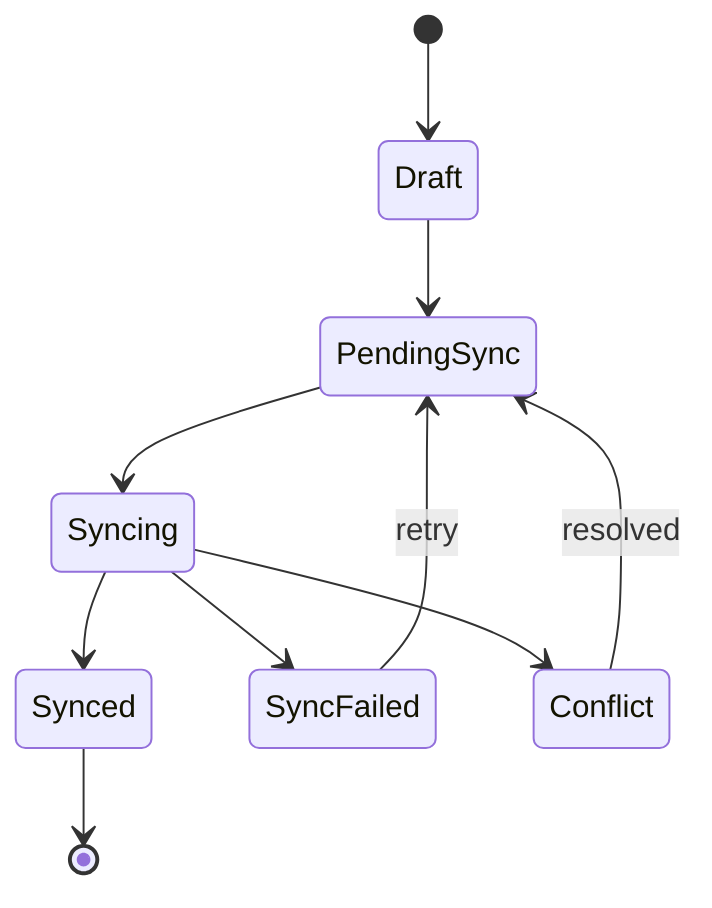

# Blueprint: AKRU

> **Dokumen utama pembangunan untuk AI Agent Antigravity**  
> Versi: 1.1  
> Tanggal baseline: 8 September 2026  
> Status: Build-ready blueprint  
> Merek utama: AKRU  
> Platform lengkap: AKRU OS  
> Ruang lingkup awal: SaaS Accounting, Finance & Tax Control untuk bisnis Indonesia

## Petunjuk Penggunaan Dokumen

Dokumen ini adalah sumber acuan utama untuk analisis, desain, implementasi, pengujian, dan penerimaan aplikasi. AI Agent wajib membangun sistem komersial yang dapat digunakan untuk operasional nyata. Pembangunan boleh dilakukan bertahap, tetapi arsitektur tidak boleh dibuat sebagai prototipe sekali pakai.

Ketentuan yang tidak boleh diubah tanpa keputusan Product Owner:

1. Satu codebase dan satu platform multi-industri; variasi industri dibuat melalui konfigurasi dan template, bukan fork aplikasi.
2. Aplikasi menggunakan arsitektur Laravel modular monolith, MySQL, responsive web/PWA, dan tetap ramah untuk deployment cPanel; VPS menjadi jalur peningkatan kapasitas.
3. Seluruh tabel domain wajib terisolasi berdasarkan `company_id`; kebocoran data antarperusahaan adalah kegagalan kritis.
4. Terdapat dua mode komersial: **AKRU Standard** tanpa ketergantungan AI dan **AKRU AI** sebagai add-on opsional.
5. AI hanya memberi saran, klasifikasi, matching, prediksi, atau peringatan. AI tidak boleh mem-posting jurnal, mengubah data pajak final, atau melakukan closing tanpa persetujuan manusia.
6. Dokumen yang sudah `posted` tidak boleh diubah atau dihapus diam-diam. Koreksi dilakukan melalui reversal, retur, void terkendali, atau adjustment yang tercatat.
7. Ekspor pengguna hanya disediakan dalam format Excel dan PDF. Jangan menyediakan ekspor CSV.
8. Aplikasi harus mendukung PWA dan offline-first untuk transaksi yang diizinkan, menggunakan IndexedDB, antrean sinkronisasi, idempotency, conflict handling, dan audit trail.
9. Sistem bersifat **Coretax-ready**, yaitu menghasilkan data, validasi, rekonsiliasi, kertas kerja, dan ekspor sesuai format resmi yang didukung. Filing langsung tidak termasuk sampai API resmi, keamanan, perizinan, dan sertifikasi siap.
10. Semua fitur wajib menjelaskan hak akses, status, validasi, dampak jurnal/subledger/pajak/stok, cara koreksi, audit trail, dan acceptance criteria.

Definisi prioritas:

- **MVP**: wajib tersedia agar v1.0 dapat digunakan dan dijual.
- **Nice-to-have**: dibangun setelah alur inti stabil dan berdasarkan feedback pengguna.
- **Future**: ekspansi besar setelah product-market fit dan kesiapan integrasi.

---

## 1. Overview

### 1.1 Deskripsi Aplikasi

AKRU adalah aplikasi SaaS berbasis web dan PWA yang mengubah transaksi operasional menjadi subledger, jurnal akuntansi, laporan keuangan, kontrol arus kas, dan kertas kerja perpajakan secara terintegrasi. Aplikasi dirancang untuk perusahaan Indonesia yang membutuhkan sistem ringan, cepat, mudah digunakan, dapat bekerja saat koneksi tidak stabil, serta menghasilkan data yang siap direview oleh pemilik, staf finance, akuntan, konsultan pajak, dan auditor.

AKRU merupakan fondasi **AKRU OS**, yaitu platform Business Operating System multi-industri. Modul industri seperti POS, manufaktur, HR/payroll, CRM, peternakan, dan project accounting menggunakan accounting engine, tax engine, approval engine, audit engine, document engine, dan reporting engine yang sama.

### 1.1A Identitas Merek

- **Nama resmi aplikasi:** AKRU.
- **Penulisan resmi:** selalu menggunakan huruf kapital `AKRU` pada logo, judul produk, halaman autentikasi, dokumen, dan komunikasi resmi.
- **Descriptor:** Accounting, Finance & Tax Control.
- **Tagline utama:** Data nyata. Kendali penuh.
- **Nama platform lengkap:** AKRU OS.
- **Edisi core tanpa AI:** AKRU Standard.
- **Add-on AI opsional:** AKRU AI.
- **Larangan identitas lama:** lakukan audit repository dan hapus seluruh nama, logo, descriptor, serta metadata merek terdahulu. Hanya identitas AKRU yang boleh tampil sebagai nama produk pada antarmuka, dokumen, source code user-facing, seed data, metadata PWA, email, dan hasil ekspor.

### 1.2 Masalah yang Diselesaikan

Masalah utama pengguna:

- Transaksi tersebar di Excel, WhatsApp, POS, rekening bank, dan dokumen fisik.
- Pembukuan dikerjakan terlambat dan hanya dirapikan ketika pelaporan pajak atau pemeriksaan.
- Pemilik tidak mengetahui posisi kas, laba, margin, piutang, hutang, persediaan, dan pajak secara aktual.
- Data penjualan, pembelian, laporan keuangan, dan pajak tidak saling cocok.
- Pencatatan ganda menimbulkan salah jurnal, duplikasi, dan biaya tenaga kerja tinggi.
- Tidak ada approval, pemisahan tugas, jejak perubahan, dan bukti pendukung yang memadai.
- Transaksi berhenti ketika internet tidak stabil.
- Software yang ada terasa rumit bagi pemilik usaha kecil atau tidak memiliki kontrol pajak yang cukup kuat.
- Konsultan pajak dan bookkeeper kesulitan mengelola banyak perusahaan secara aman dari satu tempat.

### 1.3 Target User

#### Target utama

1. UMKM dan perusahaan berkembang berbentuk PT, CV, koperasi, firma, atau usaha orang pribadi.
2. Bisnis dagang, distributor, grosir, retail, jasa, F&B, dan manufaktur ringan.
3. Perusahaan dengan satu atau beberapa cabang/gudang.
4. Perusahaan yang masih menggunakan Excel atau beberapa aplikasi yang tidak terintegrasi.
5. Perusahaan yang belum memiliki finance controller atau sistem internal control yang kuat.

#### Pengguna di dalam perusahaan

- Pemilik/direktur.
- Finance manager/controller.
- Staf accounting.
- Staf finance/treasury.
- Staf pajak.
- Staf penjualan dan pembelian.
- Admin persediaan/gudang.
- Approver.
- Auditor internal/eksternal dengan akses terbatas.

#### Mitra profesional

- Kantor konsultan pajak.
- Kantor jasa akuntan/bookkeeper.
- Konsultan implementasi.
- Partner/reseller AKRU.

### 1.4 Kenapa Mereka Membutuhkan Aplikasi Ini

Pengguna membutuhkan satu sumber data yang dapat menjawab empat pertanyaan setiap saat:

1. Berapa laba dan posisi keuangan perusahaan?
2. Berapa kas yang tersedia serta piutang/hutang yang jatuh tempo?
3. Apakah transaksi dan dokumen sudah lengkap serta disetujui?
4. Apakah data komersial sudah konsisten dengan kewajiban pajak?

Nilai utama AKRU bukan sekadar pencatatan, melainkan **kontrol usaha dari transaksi sampai pajak**.

### 1.5 Positioning

> **Satu kali input transaksi, otomatis menjadi kontrol keuangan, laporan akuntansi, dan data pajak yang siap direview.**

AKRU tidak diposisikan sebagai aplikasi akuntansi termurah atau salinan aplikasi lain. Pembeda utamanya:

- Accounting-to-tax dalam satu alur.
- Finance control yang mudah dipahami pemilik.
- Template industri Indonesia.
- Audit trail dan immutable posting.
- PWA/offline-first.
- Ekspor Excel/PDF yang rapi.
- AI kontekstual tanpa chat wajib dan tanpa ketergantungan AI.
- Partner console untuk pengelolaan multi-klien.

### 1.6 Sasaran Produk

- Menghasilkan laporan bulanan yang dapat ditutup maksimal D+7 setelah data lengkap.
- Menurunkan input ulang dan duplikasi transaksi.
- Memastikan subledger piutang, hutang, stok, aset, pajak, dan bank cocok dengan buku besar.
- Memberikan visibilitas kas dan kewajiban 30/60/90 hari.
- Menghasilkan kertas kerja pajak yang dapat ditelusuri kembali ke transaksi dan bukti.
- Memungkinkan pengguna tetap membuat draft transaksi saat offline.
- Mendukung SaaS multi-company dan jaringan mitra secara aman.

### 1.7 Ruang Lingkup Produk

#### Termasuk dalam produk inti

- Core SaaS dan subscription entitlement.
- Company, branch, warehouse, user, role, permission.
- Master data dan saldo awal.
- Sales, purchase, receivable, payable.
- Inventory dasar untuk bisnis dagang.
- Cash, bank, reconciliation, budget, cash-flow control.
- Accounting double-entry dan laporan keuangan.
- Tax control dan rekonsiliasi fiskal.
- Document management.
- Import Excel dan export Excel/PDF.
- Audit trail, approval, notification.
- PWA dan offline synchronization.
- AI/OCR sebagai add-on.

#### Tidak termasuk dalam v1.0

- Filing SPT langsung ke Coretax.
- Direct bank connection yang menyimpan kredensial internet banking.
- Marketplace dan e-commerce penuh.
- Manufacturing kompleks.
- HRIS lengkap di luar payroll/tax add-on.
- CRM lengkap.
- Mobile native terpisah.
- Custom code/fork untuk setiap pelanggan.

### 1.8 Mode Komersial

#### AKRU Standard

Semua fungsi core business, accounting, finance, inventory, workflow, audit, dan tax control berjalan secara deterministic. Rule engine, validasi, posting, laporan, dan ekspor tidak memerlukan AI.

#### AKRU AI

Mengaktifkan OCR, document understanding, rekomendasi mapping, matching bank, deteksi anomali, pencarian semantik regulasi, forecasting, dan rekomendasi tindakan. Seluruh hasil AI memiliki confidence score, sumber, alasan, status review, dan pengguna yang menyetujui.

### 1.9 Prinsip Data dan Akuntansi

- Satu transaksi sumber dapat menghasilkan dokumen lanjutan, subledger, stock movement, tax entry, dan journal set.
- Semua konsekuensi harus menunjuk kembali ke dokumen dan baris sumber.
- Total debit wajib sama dengan total kredit sebelum posting.
- Posting wajib idempotent: pengulangan request tidak boleh menggandakan jurnal, pajak, atau stok.
- Periode tertutup tidak menerima posting tanpa proses reopen yang berwenang dan teraudit.
- Nilai uang menggunakan tipe decimal, bukan floating point.
- Waktu disimpan dalam UTC dan ditampilkan sesuai zona waktu perusahaan/pengguna.
- Peraturan pajak, approval policy, mapping, dan template jurnal memiliki versi serta tanggal efektif.

### 1.10 Indikator Keberhasilan Produk

| Indikator | Target awal |
|---|---:|
| Aktivasi | Perusahaan menghasilkan laporan pertama maksimal 7 hari setelah data lengkap |
| Time-to-value | Transaksi pertama berhasil diposting pada sesi onboarding pertama |
| Rekonsiliasi | Selisih subledger vs GL = Rp0 sebelum closing |
| Keandalan posting | Tidak ada journal set tidak seimbang |
| Tenant isolation | 0 kebocoran data antar-company |
| Offline sync | Tidak ada duplikasi akibat retry |
| Export | Excel/PDF sesuai filter dan total dashboard |
| Auditability | 100% posted document dapat ditelusuri ke sumber dan actor |
| AI safety | 0 jurnal/pajak final berubah tanpa persetujuan manusia |
| Retention | Churn pelanggan berbayar ditargetkan di bawah 2,5% per bulan setelah stabil |

---

## 2. Fitur Utama

### 2.1 Core SaaS, Company, dan Access Control

| Nama fitur | Apa yang dilakukan | Contoh penggunaan/manfaat | Selesai/berhasil apabila | Prioritas |
|---|---|---|---|---|
| Registrasi tenant | Membuat tenant, perusahaan pertama, owner, subscription, dan konfigurasi awal | User bisa mendaftarkan PT/CV sehingga ruang kerja perusahaan langsung tersedia | Tenant, company, owner, plan, dan audit log tercipta atomik tanpa data parsial | MVP |
| Onboarding wizard | Memimpin setup profil, COA, pajak, cabang, rekening, saldo awal, dan user | User bisa mengikuti langkah setup sehingga tidak melewatkan data penting | Checklist tervalidasi, dapat dilanjutkan, dan menampilkan blocker go-live | MVP |
| Multi-company | Satu akun dapat mengakses beberapa perusahaan sesuai membership | Konsultan bisa berpindah klien tanpa mencampur data | Semua query, cache, export, queue, file, dan log ter-scope `company_id` | MVP |
| Company switcher | Mengubah active company dan context secara aman | User bisa berpindah PT A ke PT B sehingga dashboard menampilkan data yang benar | Context berubah, permission diperiksa ulang, dan tidak ada data context lama tersisa | MVP |
| Branch dan warehouse | Mengelola cabang, outlet, gudang, serta scope pengguna | Manager cabang hanya melihat transaksi cabangnya | Filter dan policy konsisten pada form, laporan, export, dan API | MVP |
| User, role, permission | RBAC hingga level menu dan action | Owner bisa memberi staf hak `create` tanpa `approve` | Aksi view/create/edit/submit/approve/post/void/export dibatasi policy | MVP |
| Segregation of duties | Mencegah pembuat transaksi menyetujui sendiri bila policy melarang | Kasir membuat pembayaran, finance manager menyetujui | Konflik SoD ditolak dan dicatat dalam audit log | MVP |
| Subscription & entitlement | Mengontrol paket, add-on, kuota, masa aktif, dan grace period | User paket Starter tidak dapat memakai multi-branch premium | Enforcement berlaku pada UI dan server; tidak hanya menyembunyikan menu | MVP |
| Settings terstruktur | Menyimpan pengaturan company/branch/user dengan tipe dan versi | Perusahaan menetapkan tahun buku dan format nomor dokumen | Validasi tipe, default, histori, dan effective date bekerja | MVP |

### 2.2 Master Data dan Saldo Awal

| Nama fitur | Apa yang dilakukan | Contoh penggunaan/manfaat | Selesai/berhasil apabila | Prioritas |
|---|---|---|---|---|
| Profil legal dan pajak | Menyimpan identitas badan, NIB, NPWP/NIK, PKP, KBLI, alamat, tahun buku | Data identitas otomatis digunakan pada laporan dan dokumen | Data wajib tervalidasi dan perubahan memiliki histori | MVP |
| Chart of Accounts | Membuat COA manual atau dari template industri | User memilih template distributor sehingga akun dasar tersedia | Struktur parent/detail valid, kode unik, akun posting jelas, mapping laporan lengkap | MVP |
| Customer & supplier | Menyimpan party, kontak, tax profile, termin, limit kredit, rekening | Invoice otomatis memakai termin dan treatment pajak pelanggan | Duplikasi terdeteksi, field sensitif dilindungi, histori perubahan tersedia | MVP |
| Produk dan jasa | Menyimpan SKU, unit, kategori, akun, pajak, harga, dan kebijakan stok | User menjual barang sehingga jurnal penjualan/HPP menggunakan mapping yang benar | SKU unik, mapping lengkap, unit conversion dan status aktif berfungsi | MVP |
| Bank dan kas | Menyimpan rekening perusahaan, mata uang, dan akun GL | Pembayaran dipilih dari rekening yang sesuai | Nomor rekening dimasking, scope company benar, saldo berasal dari ledger | MVP |
| Dimensi | Cost center, department, project, salesperson, dan channel | User melihat laba per proyek atau cabang | Dimensi terbawa ke subledger/jurnal/report dan dapat diwajibkan per akun | Nice-to-have |
| Saldo awal | Memuat GL, kas/bank, AR, AP, stok, aset, ekuitas, dan pajak | Perusahaan migrasi tanpa kehilangan rincian invoice lama | Debit=kredit; AR/AP/stok/aset detail cocok dengan control account | MVP |
| Import Excel | Preview, mapping kolom, validasi, dan import batch | User mengunggah master produk dari Excel sehingga tidak input satu per satu | Ada schema version, preview, row status OK/Perlu Cek/Error/Duplicate, checksum, rollback aman | MVP |
| Duplicate detection | Mendeteksi master/transaksi berdasarkan key dan kemiripan | Sistem memperingatkan supplier dengan NPWP yang sama | Duplicate tidak otomatis digabung; keputusan user tercatat | MVP |

### 2.3 Sales dan Accounts Receivable

| Nama fitur | Apa yang dilakukan | Contoh penggunaan/manfaat | Selesai/berhasil apabila | Prioritas |
|---|---|---|---|---|
| Sales invoice | Membuat invoice barang/jasa dengan diskon, pajak, termin, dimensi | User menerbitkan invoice sehingga AR, revenue, tax, dan jurnal terbentuk | Total benar, nomor unik, posting idempotent, dapat dicetak PDF | MVP |
| Customer receipt | Mencatat penerimaan dan alokasi ke satu/beberapa invoice | User menerima transfer sehingga outstanding invoice berkurang | Allocation tidak melebihi saldo; selisih/DP/FX ditangani | MVP |
| Sales return/credit | Mengoreksi penjualan melalui dokumen retur/kredit | Barang dikembalikan sehingga AR, revenue, tax, dan stok terkoreksi | Referensi invoice wajib, konsekuensi berlawanan terbentuk, audit lengkap | MVP |
| Quotation & sales order | Mengelola penawaran, pesanan, open quantity, dan status | Sales membuat SO sehingga fulfilment dapat dipantau | Quote→SO→invoice memiliki traceability dan tidak over-process | Nice-to-have |
| Delivery order | Menghasilkan pengiriman dan stock issue | Gudang mengirim barang sehingga stok keluar tercatat | Tidak melebihi kuantitas terbuka; movement dan dokumen pengiriman terhubung | Nice-to-have |
| Credit control | Memeriksa limit dan overdue sebelum transaksi | Sistem menahan order pelanggan overdue sehingga risiko piutang terkendali | Override hanya oleh role berwenang dengan alasan | Nice-to-have |
| AR aging & collection | Mengelompokkan piutang berdasarkan umur dan aktivitas penagihan | Finance melihat invoice jatuh tempo sehingga follow-up terarah | Aging cocok dengan GL dan dapat drill-down ke invoice/pembayaran | MVP |

### 2.4 Purchase dan Accounts Payable

| Nama fitur | Apa yang dilakukan | Contoh penggunaan/manfaat | Selesai/berhasil apabila | Prioritas |
|---|---|---|---|---|
| Purchase invoice | Mencatat tagihan barang/jasa, pajak, termin, dan source | User mencatat invoice supplier sehingga AP dan beban/stok terbentuk | Nomor invoice supplier unik per supplier; jurnal/tax entry benar | MVP |
| Supplier payment | Membayar dan mengalokasikan pembayaran ke invoice/DP | Finance membayar beberapa invoice sekaligus | Allocation valid, bukti terlampir, approval dan jurnal terbentuk | MVP |
| Purchase return | Mengoreksi pembelian dan kewajiban | Barang rusak dikembalikan sehingga stok/AP/pajak terkoreksi | Referensi source wajib dan posting reversal konsisten | MVP |
| Purchase request & PO | Mengelola permintaan, approval, pesanan, open quantity | Staf meminta pembelian sehingga pengeluaran terkontrol | PR→PO→receipt→bill dapat ditelusuri dan overbilling dicegah | Nice-to-have |
| Goods receipt | Mencatat penerimaan, accepted/rejected quantity, gudang, batch | Gudang menerima barang sehingga stok bertambah sebelum invoice | Movement terbentuk sekali, variance dan GRNI dapat dilaporkan | Nice-to-have |
| Three-way matching | Mencocokkan PO, penerimaan, dan invoice | Sistem menahan tagihan yang berbeda harga/qty | Tolerance configurable dan exception masuk work queue | Future |
| AP aging & payment plan | Menampilkan hutang serta kebutuhan kas | Finance menyusun pembayaran 30 hari ke depan | Aging cocok GL dan forecast memperhitungkan due date | MVP |

### 2.5 Inventory Control

| Nama fitur | Apa yang dilakukan | Contoh penggunaan/manfaat | Selesai/berhasil apabila | Prioritas |
|---|---|---|---|---|
| Inventory balance | Menyimpan saldo kuantitas/nilai per gudang/lokasi | Owner melihat stok tersedia dan nilainya | Saldo berasal dari movement; tidak diedit langsung | MVP |
| Stock movement | Ledger stok immutable untuk receipt, issue, return, transfer, adjustment | Setiap perubahan stok dapat ditelusuri ke dokumen sumber | Source, qty, unit, cost reference, actor, dan posting state tersedia | MVP |
| Costing dan HPP | Menghitung HPP sesuai kebijakan perusahaan serta menyimpan jejak layer/riwayat harga | Penjualan otomatis menghasilkan HPP yang dapat diaudit | HPP reproducible, tidak berubah diam-diam, rounding konsisten | MVP |
| Transfer antar-gudang | Mengirim dan menerima stok dengan status in-transit | Gudang A mengirim ke Gudang B sehingga kedua pihak dapat konfirmasi | Issue/receipt terhubung, pencarian produk tersedia, tidak terjadi stok ganda | Nice-to-have |
| Stock opname | Membandingkan stok fisik dan sistem serta membuat adjustment approved | User melakukan opname sehingga selisih terkontrol | Freeze/snapshot, count, variance, approval, dan jurnal tersedia | Nice-to-have |
| Batch/serial/expired | Melacak batch, serial number, dan tanggal kedaluwarsa | User menelusuri produk kedaluwarsa sehingga risiko berkurang | Tidak ada transaksi lot/serial tanpa identitas dan quantity consistency | Future |
| Reorder & stock aging | Memberi minimum stock, slow/fast/dead stock, dan rekomendasi | Buyer melihat produk yang perlu dipesan | Perhitungan memakai histori dan parameter yang dapat dijelaskan | Future |

### 2.6 Finance dan Treasury Control

| Nama fitur | Apa yang dilakukan | Contoh penggunaan/manfaat | Selesai/berhasil apabila | Prioritas |
|---|---|---|---|---|
| Cash receipt/payment | Mencatat kas masuk/keluar non-invoice dengan approval | User membayar utilitas sehingga kas, beban, dan pajak tercatat | Akun, dimensi, bukti, tax code, approval, dan jurnal lengkap | MVP |
| Bank transfer | Memindahkan dana antar-rekening dengan clearing bila berbeda tanggal | User transfer antarbank sehingga tidak menggandakan kas | Source dan destination terhubung; in-transit dapat direkonsiliasi | MVP |
| Petty cash | Mengelola imprest, reimbursement, dan pertanggungjawaban | Kas kecil diisi dan dipertanggungjawabkan | Saldo, bukti, holder, dan replenishment dapat diaudit | Nice-to-have |
| Bank statement import | Mengimpor Excel hasil converter atau format bank yang didukung | User mengunggah rekening koran sehingga rekonsiliasi lebih cepat | Statement hash mencegah duplikasi; opening/closing balance valid | MVP |
| Bank reconciliation | Mencocokkan ledger dengan statement secara manual/rule-based | User matching transfer sehingga item unreconciled berkurang | Rekonsiliasi per periode tersimpan, selisih dijelaskan, dapat reopen terkontrol | MVP |
| Budget | Menetapkan anggaran per akun/dimensi/periode | Owner membandingkan biaya aktual dengan budget | Version, approval, actual source, dan variance tersedia | Nice-to-have |
| Cash-flow forecast | Memproyeksikan kas dari AR, AP, payroll, pajak, dan komitmen | Owner melihat potensi defisit 30/60/90 hari | Asumsi terlihat, dapat diubah, dan hasil dapat ditelusuri | Nice-to-have |
| Loan schedule | Mengelola pokok, bunga, jatuh tempo, dan pembayaran | Finance memonitor cicilan bank | Schedule, allocation pokok/bunga, dan jurnal cocok | Future |

### 2.7 Accounting Engine

| Nama fitur | Apa yang dilakukan | Contoh penggunaan/manfaat | Selesai/berhasil apabila | Prioritas |
|---|---|---|---|---|
| Posting service | Satu pintu untuk menghasilkan balanced journal set dari semua modul | Invoice diposting sehingga tidak ada modul menulis `journal_lines` langsung | Balanced, source-linked, idempotent, immutable, reversible | MVP |
| Automatic journal templates | Mapping event ke akun, dimensi, debit/kredit, tax, dan effective date | Purchase service menggunakan template sehingga jurnal konsisten | Template versioned, tervalidasi, dan memiliki test fixture | MVP |
| Manual journal | Membuat jurnal penyesuaian dengan lampiran dan approval | Akuntan mencatat accrual sehingga closing lengkap | Debit=kredit, akun posting valid, periode terbuka, audit tersedia | MVP |
| General ledger & trial balance | Menampilkan mutasi dan saldo akun | User drill-down dari neraca saldo ke transaksi | Saldo konsisten dengan journal lines dan filter company/periode | MVP |
| Accrual/prepaid | Membuat schedule dan jurnal periodik | Sewa tahunan dialokasikan bulanan | Schedule total cocok source dan posting tidak ganda | Nice-to-have |
| Fixed asset | Register perolehan, penyusutan, transfer, disposal | Mesin disusutkan otomatis secara komersial/fiskal | Cost, accumulated depreciation, NBV, journal, dan histori cocok | MVP |
| Period closing | Checklist, validation, closing, dan lock periode | Finance menutup bulan sehingga data tidak berubah | Semua blocker terlihat; hanya role berwenang dapat close/reopen | MVP |
| Reversal/void | Membatalkan efek melalui transaksi lawan tanpa hard delete | Jurnal salah dibalik sehingga histori tetap utuh | Reversal terkait source, reason wajib, approval dan audit tersedia | MVP |
| Multi-currency | Transaksi, settlement, remeasurement, dan FX gain/loss | Invoice USD dibayar Rupiah sehingga selisih kurs tercatat | Rate source/date tersimpan dan hasil dapat direproduksi | Future |
| Consolidation | Menggabungkan laporan antar-entitas dan eliminasi | Grup melihat laporan konsolidasi | Mapping, elimination, currency translation, dan drill-down berfungsi | Future |

### 2.8 Tax Control Engine

| Nama fitur | Apa yang dilakukan | Contoh penggunaan/manfaat | Selesai/berhasil apabila | Prioritas |
|---|---|---|---|---|
| Tax profile & rule version | Menentukan status, objek, tarif, akun, dan masa berlaku | Transaksi 2026 memakai rule 2026 tanpa mengubah histori 2025 | Rule version dan effective date tersimpan pada tax entry | MVP |
| Tax subledger | Mencatat PPN/PPh per source line dan counterparty | User menelusuri PPN keluaran ke invoice sumber | Base, rate, amount, identity, source, GL link lengkap | MVP |
| PPN control | Rekap masukan/keluaran, validasi, kredit, dan posisi masa | Tax staff mengetahui faktur belum lengkap | Rekap cocok dengan GL dan exception dapat ditindaklanjuti | MVP |
| PPh withholding control | Mengelola PPh 21/22/23/4(2)/26 dan bukti potong | Pembayaran jasa menandai kewajiban PPh yang sesuai | Objek/rate/payee/payment/bukti potong dan journal link tersedia | MVP |
| Commercial-tax reconciliation | Membandingkan sales/purchase/GL/subledger pajak | Tax staff menemukan omzet GL yang belum masuk rekap PPN | Selisih ditampilkan per source dan resolution status | MVP |
| Fiscal reconciliation | Menyusun koreksi fiskal positif/negatif dan taxable income | User menyusun PPh Badan dari laba komersial | Koreksi memiliki dasar, akun, bukti, rule, reviewer, dan total benar | MVP |
| Commercial/fiscal depreciation | Menghitung perbedaan penyusutan | Sistem menampilkan koreksi akibat beda masa manfaat | Kedua schedule terpisah, versioned, dan rekonsiliasi jelas | MVP |
| Tax calendar | Menampilkan kewajiban, PIC, due date, dan status | User mendapat peringatan sebelum jatuh tempo | Calendar dapat difilter, reminder terkirim, completion memiliki evidence | MVP |
| Coretax-ready export | Menghasilkan dataset dan kertas kerja sesuai format resmi yang didukung | User mengunduh Excel/PDF untuk proses pelaporan | Format versioned, total tervalidasi, bukan direct filing | MVP |
| Tax audit package | Mengumpulkan GL, invoice, tax entries, rekonsiliasi, dan bukti | Konsultan menyiapkan data pemeriksaan lebih cepat | Paket dapat difilter periode/jenis pajak dan memiliki manifest/checksum | Nice-to-have |
| Direct government filing | Mengirim dan mengambil status melalui adapter resmi | User mengirim pelaporan dari aplikasi | Hanya aktif setelah API, izin, keamanan, consent, dan sertifikasi tersedia | Future |

### 2.9 Document, OCR, Import, dan Export

| Nama fitur | Apa yang dilakukan | Contoh penggunaan/manfaat | Selesai/berhasil apabila | Prioritas |
|---|---|---|---|---|
| Document archive | Menyimpan lampiran berdasarkan company, transaksi, kategori, periode | User membuka bukti dari baris jurnal | File memiliki checksum, permission, retention, preview, dan source link | MVP |
| OCR document | Mengekstrak data invoice/kuitansi/faktur/rekening koran | User scan invoice sehingga draft transaksi terisi | Hasil berupa draft, confidence dan field source; tidak auto-post | Nice-to-have |
| Rekening koran converter | Memproses satu rekening per proses, multi-bank, periode 1 bulan–1 tahun | User mengubah PDF/foto statement menjadi Excel standar | Output Excel, status OK/Perlu Cek/Error/Duplicate, tanpa journal posting | Nice-to-have |
| Import engine | Mapping, preview, validate, commit, dan row-result | User import transaksi sehingga kesalahan terlihat sebelum commit | Batch idempotent, checksum, actor, schema version, dan rollback terkontrol | MVP |
| Excel export | Mengekspor tabel dan laporan dengan filter aktif | User mengunduh aging sehingga dapat dianalisis | Total dan filter sama dengan layar; format konsisten | MVP |
| PDF export | Menghasilkan laporan/dokumen siap cetak | User mencetak laporan keuangan sehingga layout profesional | Header, identitas, periode, pagination, total, dan tanda tangan benar | MVP |
| Saved views | Menyimpan filter/kolom/sort pribadi atau tim | Finance menyimpan view invoice overdue | Scope dan permission benar, dapat reset ke default | Nice-to-have |

### 2.10 Dashboard, Reporting, dan Analytics

| Nama fitur | Apa yang dilakukan | Contoh penggunaan/manfaat | Selesai/berhasil apabila | Prioritas |
|---|---|---|---|---|
| Executive dashboard | Menampilkan sales, laba, kas, AR/AP, stok, pajak, dan alert | Owner melihat kesehatan usaha tanpa membaca semua ledger | Angka dapat drill-down dan cocok dengan laporan sumber | MVP |
| Accounting reports | GL, trial balance, P&L, balance sheet, cash flow, equity | Akuntan menyiapkan laporan bulanan | Filter, comparative, drill-down, Excel/PDF, dan closing status tersedia | MVP |
| Finance reports | Cash position, reconciliation, AR/AP aging, budget, forecast | Finance mengatur kebutuhan kas | Saldo cocok dengan subledger/GL dan as-of date jelas | MVP |
| Sales/purchase reports | Analisis pelanggan, produk, supplier, harga, diskon, margin | Owner mengetahui produk menguntungkan | Source data dan metode margin dapat ditelusuri | Nice-to-have |
| Inventory reports | Stock balance, card, valuation, movement, aging, variance | Gudang menelusuri selisih stok | Quantity/value cocok dengan movement dan GL | MVP |
| Tax reports | PPN/PPh, tax payable, reconciliation, fiscal, annual workpaper | Tax staff menyiapkan review masa/tahunan | Total cocok dengan tax subledger dan GL | MVP |
| Audit/control reports | Approval, reversal, backdate, missing document, duplicate, failed sync | Auditor menemukan transaksi berisiko | Semua exception memiliki owner, status, dan resolution evidence | MVP |

### 2.11 Workflow, Approval, Audit, dan Notification

| Nama fitur | Apa yang dilakukan | Contoh penggunaan/manfaat | Selesai/berhasil apabila | Prioritas |
|---|---|---|---|---|
| Document state machine | Mengendalikan draft→submitted→approved→posted→reversed/closed | User tidak dapat melompati approval | Transition hanya melalui service dan policy yang sah | MVP |
| Approval policy | Aturan berdasarkan jenis, nilai, branch, dan risiko | Pembayaran di atas limit membutuhkan dua approver | Policy versioned; keputusan, waktu, reason, delegation tercatat | MVP |
| Work queue | Mengumpulkan approval, error, missing data, reconciliation exception | Reviewer melihat pekerjaan yang harus diselesaikan | Queue terfilter role/company dan item selesai hilang secara konsisten | MVP |
| Audit trail | Log append-only actor, effective actor, action, diff, reason, device, correlation | Admin mengetahui siapa mengubah termin supplier | Log tidak dapat diedit pengguna biasa dan dapat diekspor PDF/Excel | MVP |
| Notification | In-app/email/push untuk due date, approval, sync, pajak, stok | Approver mendapat notifikasi pembayaran | Delivery status, retry, preference, dan deep link tersedia | Nice-to-have |

### 2.12 PWA dan Offline-First

| Nama fitur | Apa yang dilakukan | Contoh penggunaan/manfaat | Selesai/berhasil apabila | Prioritas |
|---|---|---|---|---|
| Installable PWA | Manifest, service worker, icon, update, responsive shell | User memasang AKRU di HP/desktop | Installability lolos, update aman, cache versioned | MVP |
| Offline draft | Menyimpan transaksi yang diizinkan ke IndexedDB | User membuat draft pengeluaran saat internet mati | Draft terenkripsi sesuai kemampuan platform, terikat user/device/company | MVP |
| Sync queue | Mengirim ulang transaksi saat online | Draft offline tersinkron tanpa input ulang | Retry idempotent, backoff, canonical server ID, last sync tersedia | MVP |
| Conflict handling | Mendeteksi perubahan server vs device | Dua user mengubah draft yang sama | Konflik tidak menimpa data otomatis; pilihan resolusi dan audit tersedia | MVP |
| Offline status UI | Menampilkan online/offline, pending, failed, conflict | User tahu transaksi belum masuk server | Status terlihat di global shell dan tiap record | MVP |
| Controlled online-only action | Posting, closing, approval material, tax final, dan export resmi harus online | User tidak mengira draft offline sudah final | Tombol menjelaskan alasan dan melanjutkan setelah online | MVP |

### 2.13 AI dan Automation Add-on

| Nama fitur | Apa yang dilakukan | Contoh penggunaan/manfaat | Selesai/berhasil apabila | Prioritas |
|---|---|---|---|---|
| Suggested categorization | Menyarankan akun, tax code, customer/supplier, dan dimensi | AI menyarankan biaya listrik sehingga input lebih cepat | Confidence, rationale, source, accept/reject, dan feedback tercatat | Nice-to-have |
| Smart bank matching | Menyarankan pasangan statement dan ledger | AI memasangkan transfer dengan invoice | Tidak auto-final; user review; false match dapat dibatalkan | Nice-to-have |
| Anomaly detection | Menandai duplicate, outlier, round amount, backdate, margin abnormal | Owner melihat pembayaran tidak biasa | Rule dan alasan terlihat; alert dapat diselesaikan | Nice-to-have |
| Forecast & recommendation | Menghasilkan proyeksi kas dan tindakan | Sistem menyarankan follow-up piutang | Asumsi, confidence, dan data cutoff terlihat | Future |
| Semantic regulation search | Mencari aturan dengan sumber dan effective date | Tax staff menemukan dasar perlakuan transaksi | Jawaban menyertakan sumber; keputusan final tetap manusia | Future |

### 2.14 Partner Console dan Platform Administration

| Nama fitur | Apa yang dilakukan | Contoh penggunaan/manfaat | Selesai/berhasil apabila | Prioritas |
|---|---|---|---|---|
| Partner workspace | Mengelola banyak perusahaan klien berdasarkan consent | KKP melihat status closing seluruh klien | Client isolation, membership, expiry, dan access log berfungsi | Nice-to-have |
| Portfolio dashboard | Menampilkan deadline, exception, dan completion multi-klien | Partner memprioritaskan klien overdue | Hanya metadata/status yang diizinkan tampil lintas-company | Nice-to-have |
| Assisted access | Support masuk dengan persetujuan, alasan, dan expiry | Tim support membantu pengguna | Effective actor, consent, expiry, dan semua aksi teraudit | MVP |
| Billing administration | Plan, invoice SaaS, payment, grace, suspend/reactivate | Admin mengetahui langganan jatuh tempo | Entitlement berubah konsisten dan data tidak terhapus saat suspend | MVP |
| System health | Queue, cron, storage, backup, error, sync, webhook | Admin mendeteksi kegagalan operasional | Alert, correlation ID, retry, dan runbook tersedia | MVP |

---

## 3. Halaman & Tampilan

### 3.1 Standar Tampilan Global

Desain harus profesional, modern, ringan, clean, compact, dan data-first. Antarmuka tidak menggunakan chat AI sebagai navigasi utama.

#### Desktop/tablet

- Sidebar kiri: modul dan submenu sesuai role.
- Top bar: company switcher, branch, periode, global search, create shortcut, notification, sync status, profil.
- Content header: judul, breadcrumb, status periode, primary action.
- Filter bar: tanggal, branch, status, customer/supplier, tag/dimensi.
- Content area: KPI, tabel, grafik bila relevan, dan work queue.
- Right drawer: detail cepat, activity, attachment, approval, AI suggestion.

#### Mobile

- Top bar ringkas: company, page title, online/offline indicator.
- Bottom navigation: Home, Transaksi, Tambah, Pekerjaan, Profil.
- Filter dalam bottom sheet.
- Tabel berubah menjadi card/list dengan informasi penting.
- Aksi utama mudah dijangkau ibu jari.

#### Pola halaman standar

Setiap modul transaksi memiliki:

1. List dengan search, filter, sort, saved view, pagination, selection, export.
2. Create/edit draft dengan autosave dan validation summary.
3. Detail dengan header, lines, totals, related documents, jurnal, tax entry, attachment, approval, activity.
4. Print/preview PDF.
5. Empty, loading, offline, error, permission denied, conflict, dan no-result state.

### 3.2 Struktur Navigasi



### 3.3 Daftar Halaman Core dan Onboarding

| Halaman | Isi utama | Aksi utama |
|---|---|---|
| Landing/login | Brand, login, forgot password, status layanan | Login, reset password |
| Registrasi | Identitas owner, perusahaan, consent, plan | Buat akun/perusahaan |
| Verifikasi | Email/OTP dan status verifikasi | Verifikasi, kirim ulang |
| Company selector | Daftar company, role, last access | Pilih/tambah company |
| Onboarding checklist | Profil, pajak, COA, bank, master, saldo awal, user | Mulai, lanjutkan, validasi, go-live |
| Profil perusahaan | Legal, tax, address, fiscal year, logo | Edit terkontrol |
| Cabang & gudang | Hierarki, code, address, active status | Tambah/edit/nonaktifkan |
| User & role | Membership, role, branch scope, status | Invite, ubah akses, revoke |
| Approval policy | Document type, threshold, steps, SoD | Buat versi, aktifkan |
| Subscription | Plan, usage, add-on, billing, history | Upgrade/downgrade/cancel |
| Settings | Accounting, tax, numbering, currency, print, notification | Simpan/versioning |

### 3.4 Dashboard dan Work Queue

| Halaman | Isi utama | Aksi utama |
|---|---|---|
| Executive dashboard | Sales, gross/net profit, cash, AR/AP, stock, tax, alert, trend | Drill-down, ubah periode |
| Finance dashboard | Bank balance, cash forecast, collection, payment plan | Reconcile, follow-up, schedule |
| Accounting dashboard | Unposted, imbalance, closing progress, subledger reconciliation | Review, post, close |
| Tax dashboard | Tax payable, due date, missing evidence, reconciliation difference | Review, assign, export |
| Work queue | Approval, validation error, duplicate, missing document, failed sync | Assign, resolve, approve/reject |
| Notification center | Notification grouped by type/status | Open, mark read, preference |

### 3.5 Master Data Pages

| Halaman | Isi utama | Aksi utama |
|---|---|---|
| COA | Tree/table, type, normal balance, mapping, status | Add, edit draft, import Excel |
| Customers | Identity, tax profile, terms, credit, balances | Create, edit, merge review |
| Suppliers | Identity, tax profile, bank, terms, balances | Create, edit, verify bank |
| Products/services | SKU, unit, account, tax, price, stock policy | Create, bulk update, import |
| Units/categories/brands | Code, hierarchy, conversion | Maintain master |
| Bank/cash accounts | Masked account, GL, currency, balance | Add, deactivate |
| Tax codes/rules | Type, rate, accounts, effective date, version | Draft, approve, activate |
| Dimensions | Department, cost center, project, channel | Create, set required rules |
| Opening balance | Tabs GL/AR/AP/stock/assets/tax; validation | Import, validate, approve, post |
| Import center | Template, mapping, preview, row result, batch history | Upload Excel, commit, download error Excel |

### 3.6 Transaction Pages

| Modul/halaman | Isi utama | Aksi utama |
|---|---|---|
| Sales invoice list/detail/form | Customer, lines, price, discount, tax, due date, allocation | Draft, submit, approve, post, print |
| Customer receipt | Bank/cash, amount, invoice allocation, proof | Match, approve, post |
| Sales return | Source invoice/delivery, reason, line, tax, stock | Submit, approve, post |
| Purchase invoice | Supplier, invoice number, lines, tax, due date, evidence | Draft, submit, approve, post |
| Supplier payment | Bank, payee, allocations, withholding, proof | Submit, approve, post |
| Purchase return | Source receipt/invoice, reason, lines | Submit, approve, post |
| Cash receipt/payment | Account, counterparty, amount, dimensions, tax, attachment | Draft, approve, post |
| Bank transfer | Source/destination, dates, fees, clearing | Submit, approve, post |
| Inventory balance/card | Warehouse, item, available/reserved/value, movements | Drill-down, export |
| Transfer/stock opname | Product search, source/destination/count, variance | Save offline draft, submit, approve |
| Manual journal | Date, lines, dimensions, attachment, total debit/credit | Validate, submit, approve, post |
| Fixed asset | Asset identity, cost, location, schedules, disposal | Add, depreciate, transfer, dispose |

### 3.7 Finance, Accounting, dan Closing Pages

| Halaman | Isi utama | Aksi utama |
|---|---|---|
| Bank statement | Account, period, opening/closing, imported lines, status | Import, validate, remove uncommitted batch |
| Bank reconciliation | Statement vs ledger, suggested match, difference | Match, unmatch, create draft, finalize |
| AR aging | Bucket, customer, invoice, due date, collector | View statement, record receipt |
| AP aging | Bucket, supplier, invoice, due date, payment plan | Create payment, schedule |
| Cash-flow forecast | Opening cash, expected inflow/outflow, scenarios | Edit assumption, compare scenario |
| Budget | Version, account/dimension/month, actual, variance | Import, submit, approve |
| Journal explorer | Journal set, source, lines, tax/stock link, audit | Drill-down, reverse by permission |
| General ledger | Account movement, opening, debit, credit, balance | Filter, drill-down, export |
| Trial balance | Opening/movement/ending, comparative | Drill-down, export |
| Closing workbench | Checklist, reconciliation, exceptions, approvers | Resolve, close, reopen by permission |
| Financial statements | P&L, balance sheet, cash flow, equity | Compare, drill-down, Excel/PDF |

### 3.8 Tax Control Pages

| Halaman | Isi utama | Aksi utama |
|---|---|---|
| Tax calendar | Obligation, period, PIC, due date, status, evidence | Assign, complete, reopen |
| Tax transaction workbench | Source, counterparty, DPP, rate, tax, GL, validation | Review, correct source, approve |
| PPN control | Output/input, creditable status, difference, missing identity | Resolve exception, export |
| PPh control | PPh 21/22/23/4(2)/26, payee, object, withholding evidence | Review, mark issued/received |
| Commercial-tax reconciliation | GL vs sales/purchase vs tax subledger | Investigate, assign, resolve |
| Fiscal reconciliation | Commercial profit, positive/negative corrections, evidence | Add correction, review, approve |
| Depreciation fiscal | Commercial vs fiscal schedules and differences | Review, export |
| Corporate income tax | Taxable income, compensation, tax due, credits, installment | Calculate, review, freeze draft |
| Coretax-ready export | Format version, validation, manifest, files | Generate Excel/PDF, archive |
| Tax audit package | Period, tax type, report/document selection | Generate package, checksum |

### 3.9 Document, Audit, Sync, dan Administration Pages

| Halaman | Isi utama | Aksi utama |
|---|---|---|
| Document library | Category, period, source, expiry, owner, OCR status | Upload/scan, preview, link, archive |
| OCR review | Source image/PDF, extracted fields, confidence, differences | Accept/edit/reject to draft |
| Approval inbox | Pending requests, risk, amount, requester, SLA | Approve/reject/request change |
| Audit explorer | Actor, effective actor, target, action, diff, timestamp | Filter, drill-down, export |
| Offline sync center | Device, local ID, server ID, status, retry, conflict | Retry, resolve, quarantine |
| Device management | Device name, user, last sync, token, status | Revoke, rename, inspect |
| Export center | Report, parameters, requester, status, expiry | Download Excel/PDF, regenerate |
| System health | Queue, cron, storage, backup, error rate | Retry safe job, open incident |
| Partner console | Client list, role, closing/tax status, deadlines | Switch client, request access |
| Support access | Consent, reason, expiry, effective actor | Grant/revoke monitored access |

---

## 4. Alur Penggunaan

### 4.1 Alur Utama Pengguna Baru



Langkah detail:

1. Owner registrasi, verifikasi identitas akun, dan membuat company.
2. Sistem menetapkan owner role dan paket subscription.
3. Owner mengisi profil legal/pajak, cabang, gudang, rekening, tahun buku, serta periode mulai.
4. User memilih template COA industri atau mengimpor COA dari Excel.
5. User mengimpor customer, supplier, produk/jasa, dan saldo awal.
6. Sistem menjalankan validasi GL, AR, AP, stock, asset, dan tax control account.
7. Owner mengundang staf, menetapkan scope dan approval policy.
8. Setelah semua blocker diselesaikan, owner menyetujui go-live.
9. Sistem mengunci baseline saldo awal dan membuka transaksi operasional.

### 4.2 Alur Transaksi sampai Laporan



1. User membuat draft manual, import Excel, atau hasil OCR.
2. Sistem memeriksa company, period, master, amount, account mapping, tax mapping, attachment, duplicate, dan permission.
3. Transaksi dikirim untuk approval jika diwajibkan.
4. Approval menghasilkan keputusan dan policy snapshot.
5. Posting service menyimpan consequence dalam satu database transaction.
6. Setelah commit, outbox/queue memperbarui projection, notifikasi, dan export secara idempotent.
7. User dapat membuka related document graph dari source sampai journal/tax/stock.

### 4.3 Alur Bank Statement dan Rekonsiliasi

1. User memilih satu rekening dan periode.
2. User mengunggah Excel standar atau file hasil rekening koran converter.
3. Sistem memvalidasi identitas rekening, saldo awal/akhir, tanggal, hash, dan duplikasi baris.
4. Baris diberi status `OK`, `Perlu Cek`, `Error`, atau `Duplicate`.
5. Rule-based matching bekerja lebih dahulu; AI matching hanya bila add-on aktif.
6. User menerima, mengubah, menolak, atau membuat draft transaksi dari suggestion.
7. User menyelesaikan selisih dan memfinalisasi rekonsiliasi.
8. Rekonsiliasi final menyimpan snapshot, reviewer, waktu, dan unexplained difference jika ada.

Catatan: Rekening Koran Converter menghasilkan Excel standar dan tidak langsung mem-posting jurnal.

### 4.4 Alur Month-End Closing

1. Sistem membuat closing checklist sesuai company dan periode.
2. User menyelesaikan bank reconciliation.
3. User memastikan AR/AP subledger, inventory, asset, payroll, dan tax subledger cocok dengan GL.
4. User memeriksa unposted transaction, negative stock, duplicate, missing attachment, backdate, dan failed sync.
5. User membuat accrual, prepaid allocation, depreciation, FX, atau adjustment.
6. Reviewer menyetujui checklist dan laporan draft.
7. Authorized role melakukan closing.
8. Sistem mengunci periode, menyimpan closing snapshot, serta menghasilkan report pack.
9. Reopen hanya melalui request, approval, alasan, dan audit trail.

### 4.5 Alur Tax Control

1. Tax engine mengambil tax entries dari transaksi sumber.
2. Sistem melakukan rekonsiliasi sales–revenue–PPN keluaran dan purchase/expense/inventory–PPN masukan.
3. Sistem memeriksa withholding PPh, counterparty identity, document number, date, base, rate, dan evidence.
4. Exception masuk tax work queue.
5. User memperbaiki source transaction atau memberi resolution yang sah; tidak mengedit tax report secara diam-diam.
6. Sistem menyusun fiscal reconciliation dan corporate income tax workpaper.
7. Reviewer menyetujui dataset dan mengunci versi draft pajak.
8. Sistem menghasilkan Excel/PDF Coretax-ready dan menyimpan manifest/checksum.
9. Pelaporan dilakukan di luar aplikasi sampai integrasi resmi diaktifkan.

### 4.6 Alur Offline dan Sinkronisasi



Aturan:

- Draft offline disimpan di IndexedDB dengan `local_id`, `company_id`, `user_id`, `device_id`, version, timestamp, payload hash, dan idempotency key.
- Saat online, queue mengirim transaksi sesuai urutan dependency.
- Server selalu melakukan ulang authentication, authorization, validation, dan company scope.
- Retry dengan idempotency key yang sama mengembalikan hasil canonical, bukan membuat record baru.
- Conflict tidak boleh menggunakan silent last-write-wins untuk data keuangan.
- Posting, closing, approval material, tax finalization, dan export resmi tetap online-only.

### 4.7 Alur Approval

1. User submit dokumen.
2. Sistem memilih approval policy version berdasarkan company, branch, document type, amount, dan risiko.
3. Sistem memeriksa segregation of duties dan delegation.
4. Approver menerima work item.
5. Approver dapat approve, reject, atau request change dengan catatan.
6. Perubahan material setelah approval membatalkan approval lama dan meminta approval ulang.
7. Keputusan final memungkinkan proses/posting sesuai policy.

### 4.8 Alur Koreksi Transaksi Posted

- User tidak dapat mengedit atau hard-delete dokumen posted.
- User memilih `Retur`, `Void`, `Reverse`, atau `Adjustment` sesuai jenis kesalahan.
- Sistem meminta reason, tanggal koreksi, evidence, dan approval.
- Sistem membuat consequence lawan yang menunjuk dokumen sumber.
- Laporan menampilkan transaksi asli dan koreksi secara transparan.

### 4.9 Alur Alternatif dan Penanganan Error

| Kondisi | Respons sistem | Tindakan pengguna |
|---|---|---|
| Data wajib kosong | Simpan draft bila aman; tampilkan field error | Lengkapi data |
| Mapping akun/pajak tidak tersedia | Blok submit/posting | Pilih mapping atau minta admin |
| Debit dan kredit tidak seimbang | Blok posting | Perbaiki jurnal/template |
| Periode tertutup | Blok posting/backdate | Gunakan periode terbuka atau request reopen |
| Duplicate import/request | Tampilkan record canonical | Review; jangan membuat duplikat |
| Permission ditolak | Tampilkan tindakan yang tidak diizinkan | Minta role/approval yang sah |
| Subscription limit | Simpan data yang sudah sah; blok fitur baru sesuai policy | Upgrade plan atau kurangi usage |
| Internet terputus | Beralih ke offline draft untuk fitur yang diizinkan | Lanjutkan dan sinkron saat online |
| Sync gagal sementara | Retry otomatis dengan backoff | Pantau; manual retry bila diperlukan |
| Conflict | Karantina record dan tampilkan perbandingan | Pilih server/device/merge/revisi |
| OCR confidence rendah | Status `Perlu Cek`; jangan auto-post | Koreksi field dan approve |
| AI tidak tersedia/quota habis | Gunakan rule/manual flow | Lanjutkan pada AKRU Standard |
| Export gagal | Job dapat di-retry tanpa menggandakan file final | Retry dari Export Center |
| Queue/cron bermasalah | Alert system health dan incident log | Admin menjalankan runbook |

---

## 5. Roadmap

### 5.1 Sprint 00 — Foundation Sebelum v1.0

Tujuan: memastikan fondasi aman sehingga modul tidak perlu ditulis ulang.

- Repository, branching, CI, environment, dan deployment pipeline.
- Laravel modular monolith skeleton.
- MySQL schema convention dan migration rules.
- Tenant/company resolver dan mandatory company scope.
- Authentication, membership, RBAC, policy tests.
- Shared document, audit, approval, posting, tax, import/export contracts.
- Money, quantity, rounding, date/time, sequence, idempotency standards.
- PWA shell, IndexedDB wrapper, sync contract, device registration.
- Error handling, correlation ID, logging, queue+cron, health check.
- Backup and restore drill.
- Design system dan reusable page components.
- Seed/template strategy yang aman untuk production.

Sprint 00 selesai apabila tenant-isolation test, authentication test, deployment test, backup-restore test, dan skeleton PWA lulus.

### 5.2 v1.0 — MVP Komersial

Tujuan: pelanggan dapat menyelesaikan alur setup → transaksi → accounting → finance control → tax control → laporan.

Fitur wajib:

- Registrasi tenant dan onboarding wizard.
- Company, branch, warehouse, user, role, permission.
- Subscription/entitlement dasar.
- Company/tax profile, COA, customer, supplier, product/service, bank/cash, tax master.
- Import Excel master dan saldo awal.
- Saldo awal GL, AR, AP, inventory, fixed asset, dan tax.
- Sales invoice/receipt/return.
- Purchase invoice/payment/return.
- Cash receipt/payment dan bank transfer.
- Inventory balance, movement, basic costing/HPP.
- Bank statement import dan reconciliation.
- AR/AP aging dan payment/collection visibility.
- Posting engine, automatic/manual journal, GL, trial balance.
- Fixed asset dan commercial/fiscal depreciation dasar.
- Closing checklist, lock, reversal, controlled reopen.
- Tax subledger, PPN, PPh, commercial-tax reconciliation, fiscal reconciliation, PPh Badan workpaper.
- Tax calendar dan Coretax-ready Excel/PDF export.
- Executive, finance, accounting, dan tax dashboards.
- Document attachment dan document library dasar.
- Workflow, approval, work queue, audit trail.
- Excel/PDF reports; tanpa CSV.
- PWA installable, offline draft, sync queue, conflict handling, sync center.
- Assisted support access dengan consent dan expiry.
- System health, backup, and operational logging.

Kriteria launch v1.0:

1. Minimal lima perusahaan pilot menyelesaikan satu siklus bulan.
2. Semua pilot menghasilkan trial balance, financial statements, bank reconciliation, AR/AP reconciliation, dan tax workpaper.
3. Tidak ada journal imbalance, duplicate posting, atau tenant leakage.
4. Semua high-severity defect ditutup.
5. Backup berhasil direstore pada environment terpisah.
6. Dokumentasi admin, user, support, deployment, dan recovery tersedia.
7. Data demo terpisah dari production; tidak ada placeholder/dummy di tenant pelanggan.

### 5.3 v1.1 — Perbaikan dari Feedback Awal

Tujuan: meningkatkan activation, kecepatan penggunaan, dan retensi.

- Quotation, sales order, delivery order.
- Purchase request, purchase order, goods receipt.
- Credit control.
- Stock transfer dan stock opname.
- Budget versus actual.
- Cash-flow forecast 30/60/90 hari.
- Petty cash.
- Accrual dan prepaid schedule.
- OCR invoice/kuitansi/faktur/rekening koran.
- Rekening Koran Converter Excel-only.
- Suggested bank matching.
- Suggested account/tax mapping.
- Saved view dan custom dashboard sederhana.
- Notification email/push.
- Partner console dan portfolio deadline.
- Tax audit package/data room.
- Onboarding analytics, in-product checklist, contextual help.
- Performance optimization berdasarkan query nyata.
- Peningkatan print/PDF berdasarkan kebutuhan industri.

Kriteria v1.1:

- Fitur hanya diprioritaskan dari evidence penggunaan dan support ticket.
- Median waktu onboarding turun.
- Persentase transaksi manual yang dapat diotomasi meningkat.
- Tidak ada regresi terhadap accounting/tax golden tests.

### 5.4 v2.0 — Ekspansi Besar

Tujuan: mengembangkan AKRU menjadi **AKRU OS**, platform Business Operating System multi-industri.

- AKRU POS resmi dengan offline sales, shift, tender, settlement, dan sync.
- Advanced inventory: reservation, batch, serial, expired, landed cost, reorder, aging.
- Multi-currency dan FX remeasurement.
- Consolidation dan elimination.
- Manufacturing ringan: BOM, work order, WIP, yield, variance.
- Payroll, BPJS, dan PPh 21 terintegrasi.
- CRM dan sales pipeline.
- Project accounting dan profitability.
- Public API, webhook, marketplace/e-commerce adapters.
- Direct bank/payment adapters melalui credential-isolated integration.
- Advanced AI anomaly, forecast, recommendation, dan semantic regulation search.
- Direct Coretax/government adapter hanya setelah syarat resmi terpenuhi.
- Industry packs: distributor, retail, F&B, jasa, manufaktur ringan, agribisnis/peternakan.
- Advanced partner/reseller administration.

### 5.5 Urutan Pembangunan Modul

1. Core, identity, tenancy, access, audit, shared contracts.
2. Master data dan onboarding.
3. Accounting engine dan reporting foundation.
4. Sales/AR, purchase/AP, cash/bank.
5. Inventory basic dan fixed assets.
6. Bank reconciliation dan finance control.
7. Tax engine, fiscal reconciliation, dan Coretax-ready export.
8. PWA offline queue dan conflict management per transaction type.
9. Dashboard, work queue, export center, subscription administration.
10. Pilot hardening, migration, documentation, backup/restore, launch.

---

## 6. Input Data yang Wajib Didukung

| Kelompok | Data minimum |
|---|---|
| Company | Legal name, entity type, NIB, NPWP/NIK, PKP, KBLI, address, fiscal year, timezone, currency |
| Organization | Branch, outlet, warehouse, department, cost center, project |
| Access | User, role, permission, branch scope, approval limit |
| Accounting | COA, mapping report, retained earnings, period, journal templates |
| Customer/supplier | Code, identity, tax profile, terms, limit, address, business contact, bank account |
| Product/service | SKU, category, unit, price, tax, revenue/inventory/COGS/expense accounts |
| Bank/cash | Bank, masked account number, currency, GL account, opening balance |
| Opening balance | GL, cash/bank, AR by invoice, AP by invoice, inventory qty/value, asset, equity, tax |
| Sales | Customer, date, lines, quantity, price, discount, tax, due date, payment, return |
| Purchase | Supplier, date, lines, quantity, price, tax, due date, payment, return |
| Finance | Cash in/out, transfer, statement line, allocation, budget, forecast assumption |
| Inventory | Warehouse, item, movement, quantity, unit, cost reference, batch/serial optional |
| Asset | Asset class, acquisition date/cost, useful life, method, location, fiscal group |
| Tax | Tax type/code, base, rate, counterparty identity, evidence, payment/credit, rule version |
| Document | File, category, source, checksum, period, expiry, retention, uploader |

Input channel yang didukung:

- Form manual.
- Import Excel menggunakan template versioned.
- Upload PDF/foto untuk document archive dan OCR add-on.
- PWA offline draft.
- API/integration pada roadmap yang sesuai.

---

## 7. Output Laporan dan Dokumen

### 7.1 Accounting

- Journal register dan journal voucher.
- General ledger dan subsidiary ledger.
- Trial balance.
- Balance sheet/neraca.
- Profit and loss/laba rugi.
- Cash-flow statement.
- Statement of changes in equity.
- Comparative report antarbulan/tahun.
- Profitability per branch/cost center/project.
- Closing report dan reconciliation checklist.

### 7.2 Finance Control

- Cash and bank position.
- Cash book dan bank book.
- Bank reconciliation dan outstanding item.
- AR aging, customer statement, collection report.
- AP aging, supplier statement, payment schedule.
- Budget versus actual.
- Cash-flow forecast 30/60/90 hari.
- Working-capital dashboard.
- Loan and commitment schedule pada versi lanjutan.

### 7.3 Sales, Purchase, dan Inventory

- Sales by customer/product/branch/salesperson/channel.
- Gross margin by product/customer/branch.
- Discount, return, unpaid invoice, open order.
- Purchase by supplier/product/branch.
- Purchase price history dan variance.
- Open PO, receipt not billed, invoice not received.
- Stock balance, stock card, movement, valuation, HPP.
- Negative stock dan stock variance.
- Stock aging, fast/slow/dead stock pada versi lanjutan.

### 7.4 Tax Control

- PPN output/input recap dan position.
- PPh 21/22/23/4(2)/26 recap.
- Withholding evidence monitoring.
- Tax payable, credit, payment, dan due-date report.
- Sales–revenue–PPN reconciliation.
- Purchase/expense/inventory–PPN reconciliation.
- Commercial–fiscal reconciliation.
- Positive/negative fiscal correction.
- Commercial/fiscal depreciation.
- Taxable income dan corporate income tax workpaper.
- Tax installment workpaper.
- Coretax-ready Excel/PDF dataset dan validation report.
- Tax audit package pada v1.1.

### 7.5 Control dan Audit

- User activity dan access log.
- Approval/rejection/delegation log.
- Record change diff.
- Posted reversal/void/adjustment report.
- Backdated transaction.
- Missing attachment/document.
- Duplicate and gap report.
- Import batch result.
- Offline sync, retry, conflict, quarantine report.
- Support assisted-access report.

### 7.6 Dokumen Operasional

- Sales invoice, receipt, credit note, statement.
- Purchase order pada v1.1, goods receipt, supplier payment voucher.
- Cash receipt/payment voucher dan bank transfer evidence.
- Journal voucher.
- Stock transfer/opname/adjustment document.
- Financial statement pack.
- Tax workpaper pack.

Seluruh laporan pengguna dapat dilihat di aplikasi dan diekspor dalam **Excel** dan **PDF**. Tidak ada ekspor CSV.

---

## 8. Role dan Permission Baseline

| Role | Scope utama |
|---|---|
| Tenant Owner | Subscription, company, user, policy, semua laporan; aksi material tetap mengikuti approval |
| Company Admin | Master, user membership, settings operasional; tidak otomatis berhak posting/close |
| Director/Owner Viewer | Dashboard, laporan, approval sesuai limit |
| Finance Manager | Cash/bank, AR/AP, budget, reconciliation, approval |
| Accountant | COA, journal, ledger, asset, reconciliation, closing preparation |
| Tax Staff/Consultant | Tax workbench, fiscal reconciliation, tax export, evidence |
| Sales Staff | Customer, sales draft, receipt sesuai permission |
| Purchase Staff | Supplier, purchase draft, request/order sesuai permission |
| Warehouse Staff | Inventory receipt/issue/transfer/opname sesuai scope |
| Approver | Approval berdasarkan policy dan limit |
| Auditor | Read-only, export terbatas, time-bound access |
| Support Agent | Assisted access hanya dengan consent, reason, expiry, dan effective actor log |

Setiap permission minimal memisahkan: `view`, `create`, `edit_draft`, `submit`, `approve`, `reject`, `post`, `reverse`, `void`, `close_period`, `reopen_period`, `import`, `export`, dan `manage_settings`.

---

## 9. Status dan State Machine Baseline

### 9.1 Dokumen bisnis

`draft → submitted → approved → processed/posted → partially_paid/paid/closed`

Jalur koreksi: `draft → cancelled` atau `posted → reversed/voided` melalui dokumen konsekuensi.

### 9.2 Import

`uploaded → mapping → validating → preview_ready → committing → completed/completed_with_errors/failed`

Status baris: `OK`, `Perlu Cek`, `Error`, `Duplicate`, `Skipped`, `Imported`.

### 9.3 Offline sync

`draft → pending_sync → syncing → synced/sync_failed/conflict/rejected`

### 9.4 Tax work item

`draft → needs_review → reviewed → approved → exported → archived`

### 9.5 Closing

`open → closing_in_progress → review → closed → reopen_requested → reopened`

---

## 10. Matriks Jurnal Minimum

| Event | Debit | Kredit |
|---|---|---|
| Sales invoice jasa | Piutang usaha | Pendapatan; hutang PPN bila berlaku |
| Sales invoice barang | Piutang usaha | Penjualan; hutang PPN bila berlaku |
| HPP penjualan | HPP | Persediaan |
| Customer receipt | Kas/bank | Piutang usaha |
| Customer advance | Kas/bank | Uang muka pelanggan; pajak sesuai rule |
| Sales return | Retur/penjualan dan pajak terkait | Piutang/kas |
| Purchase inventory invoice | Persediaan dan pajak masukan | Hutang usaha |
| Purchase expense invoice | Beban/aset dan pajak masukan | Hutang usaha |
| Supplier payment | Hutang usaha | Kas/bank; hutang PPh sesuai treatment |
| Supplier advance | Uang muka supplier | Kas/bank |
| Purchase return | Hutang/kas | Persediaan/beban dan pajak terkait |
| Stock adjustment plus | Persediaan | Gain/adjustment account |
| Stock adjustment minus | Loss/adjustment account | Persediaan |
| Fixed asset acquisition | Aset tetap dan pajak masukan | Hutang/kas |
| Depreciation | Beban penyusutan | Akumulasi penyusutan |
| Accrual | Beban | Hutang akrual |
| Prepaid allocation | Beban | Biaya dibayar di muka |
| Bank charge | Beban bank | Bank |
| Tax payment | Hutang pajak | Bank |

Nilai dan akun aktual selalu berasal dari versioned posting template, source transaction, tax rule, dan company policy. Matriks ini adalah baseline, bukan hard-coded journal dalam controller.

---

## 11. Arsitektur Teknis

### 11.1 Stack Baseline

- Backend: Laravel/PHP modular monolith.
- Frontend: Blade, Tailwind CSS, Alpine.js; JavaScript tambahan hanya bila diperlukan.
- Database: MySQL shared database dengan mandatory `company_id`.
- Queue: database queue dan cron sebagai baseline; Redis boleh menjadi peningkatan, bukan dependency.
- PWA: service worker, manifest, IndexedDB, background/foreground sync.
- Storage: local/object storage melalui adapter, dengan checksum dan tenant path isolation.
- Hosting: cPanel-friendly; VPS/cloud sebagai jalur scale.

### 11.2 Module Boundary

- Core & Identity.
- Master Data.
- Sales & AR.
- Purchase & AP.
- Inventory.
- Treasury/Finance.
- Accounting.
- Tax.
- Asset.
- Document/OCR.
- Workflow/Approval.
- Audit/Notification.
- Reporting/Analytics.
- Integration.
- Subscription/Billing.
- Partner Console.

Business module hanya memanggil public contract/shared engine. Modul bisnis tidak boleh menulis langsung ke `journal_lines`, `tax_entries`, atau saldo persediaan.

### 11.3 Request-to-Posting

1. Request melewati authentication, tenant resolver, company/branch scope, rate limit, dan correlation middleware.
2. Form request melakukan syntax validation; policy melakukan authorization.
3. Application service memuat aggregate dan menjalankan business rule/state transition.
4. Satu database transaction menyimpan dokumen/subledger, posting consequence, audit, dan outbox.
5. Setelah commit, queue menjalankan notification, projection, webhook, atau export.
6. Response mengembalikan canonical ID, number, version, status, warning, dan related links.

### 11.4 Kolom Canonical

Tabel domain minimal memiliki:

- `id`, `company_id`.
- `created_at`, `created_by`, `updated_at`, `updated_by`.
- `version` untuk optimistic locking bila relevan.
- `branch_id` dan dimension keys bila relevan.
- `status`, `processing_status`, `posting_status` untuk dokumen.
- `source_type`, `source_id`, `source_line_id` untuk consequences.
- `idempotency_key`, `payload_hash`, `external_id` untuk import/integration/sync.
- `deleted_at` hanya pada draft/master yang diizinkan.

### 11.5 Tabel Utama

#### Core

`companies`, `company_profiles`, `branches`, `users`, `company_users`, `roles`, `permissions`, `role_permissions`, `plans`, `plan_features`, `subscriptions`, `company_features`, `settings`, `document_sequences`, `currencies`, `exchange_rates`, `fiscal_periods`.

#### Master

`contacts`, `customers`, `suppliers`, `bank_accounts`, `accounts`, `tax_codes`, `units`, `item_categories`, `brands`, `items`, `item_units`, `warehouses`, `warehouse_locations`, `departments`, `cost_centers`, `projects`.

#### Transactions

`sales_invoices`, `sales_invoice_lines`, `customer_receipts`, `receipt_allocations`, `sales_returns`, `purchase_invoices`, `purchase_invoice_lines`, `supplier_payments`, `payment_allocations`, `purchase_returns`, `cash_transactions`, `bank_transfers`.

#### Inventory, accounting, tax

`stock_movements`, `inventory_balances`, `cost_layers`, `stock_opnames`, `journal_sets`, `journal_lines`, `posting_templates`, `account_balances`, `tax_rule_sets`, `tax_entries`, `tax_reconciliations`, `fiscal_corrections`, `tax_workpapers`, `fixed_assets`, `depreciation_schedules`.

#### Shared

`attachments`, `documents`, `ocr_jobs`, `import_batches`, `import_rows`, `export_jobs`, `approval_policies`, `approval_requests`, `approval_decisions`, `audit_logs`, `outbox_events`, `notifications`, `devices`, `sync_queues`, `sync_logs`, `conflicts`.

### 11.6 Security dan Privacy

- Semua endpoint server-side melakukan company scope dan authorization.
- ID publik tidak boleh memudahkan enumerasi data sensitif.
- Password di-hash menggunakan standar Laravel yang aman.
- MFA disiapkan untuk owner/admin/approver.
- Session/device dapat direvoke.
- Nomor rekening dan identitas sensitif dimasking sesuai role.
- File menggunakan signed access dan scope company.
- Audit log append-only dan tidak menampung secret mentah.
- Backup terenkripsi, memiliki retention, dan restore drill berkala.
- Tidak menyimpan password/kredensial internet banking.
- Support access membutuhkan consent, tujuan, batas waktu, dan effective actor.

---

## 12. API, Event, dan Integrasi

- Endpoint mengikuti `/api/v1/...` dan wajib versioned.
- API response memiliki canonical resource ID, company context, status, version, dan error structure konsisten.
- Mutation menerima idempotency key.
- Pagination, filter, sort, date range, dan branch scope konsisten.
- Webhook ditandatangani, retry idempotent, dan memiliki delivery log.
- Domain event menggunakan past tense, misalnya `SalesInvoicePosted`, `PaymentAllocated`, `PeriodClosed`, `TaxDatasetExported`.
- Event minimal membawa company, source, actor, correlation, occurred time, dan schema version.
- n8n/automation eksternal hanya melalui API/webhook; tidak boleh menjalankan accounting core langsung.
- Government, bank, marketplace, dan payment integration memakai adapter terisolasi.

---

## 13. Testing dan Quality Gates

### 13.1 Test wajib

- Unit test untuk kalkulasi, rule, state machine, dan rounding.
- Feature test untuk authorization, workflow, posting, closing, import/export.
- Tenant isolation test pada setiap module/query/report/export/job.
- Golden journal test untuk setiap event bisnis.
- Tax rule version/effective-date test.
- Subledger-to-GL reconciliation test.
- Idempotency test untuk retry API/import/offline.
- Offline sync dan conflict test.
- PDF/Excel total/filter consistency test.
- Backup/restore dan migration test.
- Security test untuk IDOR, file access, privilege escalation, dan mass assignment.
- Performance test pada volume transaksi representatif.

### 13.2 Definition of Done per fitur

Fitur belum selesai sebelum seluruh hal berikut terpenuhi:

1. User story dan acceptance criteria lulus.
2. Permission dan company scope diterapkan server-side.
3. Validasi bisnis dan state transition tersedia.
4. Dampak subledger/stock/jurnal/pajak didefinisikan atau dinyatakan tidak ada.
5. Correction/reversal behavior tersedia.
6. Audit trail dan notification yang relevan tersedia.
7. Offline behavior didefinisikan.
8. Import/export behavior didefinisikan.
9. Automated test lulus.
10. Dokumentasi pengguna dan teknis diperbarui.
11. Tidak ada placeholder, fake success, atau tombol tanpa fungsi.
12. UI memiliki loading, empty, error, permission, offline, dan conflict state.

---

## 14. Instruksi Eksekusi untuk AI Agent Antigravity

1. Baca seluruh blueprint sebelum membuat atau mengubah kode.
2. Audit repository dan tulis gap analysis terhadap blueprint.
3. Jangan menghapus fungsi lama yang valid hanya untuk menyederhanakan implementasi.
4. Kerjakan sesuai urutan dependency; jangan mulai dashboard dari data dummy sebelum engine sumber tersedia.
5. Buat modul melalui public service contract dan domain event, bukan query lintas-modul sembarangan.
6. Semua migration harus aman, reversible jika memungkinkan, dan kompatibel dalam satu release window.
7. Gunakan transaction, lock, unique constraint, dan idempotency untuk proses keuangan.
8. Jangan hard-code aturan pajak atau akun yang seharusnya versioned/configurable.
9. Jangan menggunakan float untuk uang, kuantitas, rate, atau percentage.
10. Jangan membuat fitur AI sebagai syarat transaksi core.
11. Jangan menyediakan ekspor CSV.
12. Jangan mem-posting hasil OCR/converter/AI tanpa review dan persetujuan.
13. Jangan mengizinkan posted record dihapus atau diedit langsung.
14. Jangan menganggap UI restriction cukup; semua authorization wajib di server.
15. Setelah setiap slice, jalankan test, dokumentasikan hasil, dan laporkan blocker.

Format laporan kerja setiap task:

```md
## Task Result
- Scope:
- Files changed:
- Database changes:
- Permission changes:
- Posting/tax/stock impact:
- Offline behavior:
- Tests executed:
- Test result:
- Known limitations:
- Next dependency:
```

### Perintah awal yang disarankan untuk Antigravity

```text
Gunakan Blueprint_AKRU_Antigravity.md sebagai source of truth.
Mulai dengan repository audit dan gap analysis. Setelah itu kerjakan Sprint 00 secara berurutan.
Jangan langsung membangun seluruh halaman sekaligus. Selesaikan satu vertical slice dari database,
domain rule, permission, service, posting consequence, audit, UI, API, export, offline behavior,
automated test, hingga dokumentasi. Jangan mengubah product invariants tanpa persetujuan Product Owner.
```

---

## 15. Keputusan yang Masih Harus Divalidasi melalui Pilot

- Batas fitur dan usage setiap paket.
- Harga final di luar Starter Accounting-to-Tax Rp99.000/company/bulan.
- Jumlah user/cabang/gudang pada setiap plan.
- Format Coretax-ready yang menjadi prioritas pertama.
- Bank statement format yang paling banyak dipakai pelanggan awal.
- Template industri pertama setelah distributor/retail.
- Volume transaksi untuk sizing shared hosting versus VPS.
- Retention dokumen dan kapasitas storage setiap plan.
- SLA support, onboarding, migration, dan assisted access.
- Fitur AI yang benar-benar menghemat waktu dan layak menjadi add-on.

---

## 16. Ringkasan Akhir

AKRU dibangun dengan alur utama:

> **Setup → Master → Transaksi → Subledger/Stock → Jurnal → Rekonsiliasi → Laporan → Tax Control → Coretax-ready Export**

Sistem harus ringan bagi pengguna, tetapi ketat pada integritas data. Setiap fitur wajib aman untuk multi-company, memiliki permission dan audit trail, tidak menggandakan transaksi ketika offline/retry, serta tidak membiarkan AI menggantikan keputusan akuntansi atau pajak manusia.

Blueprint ini mencakup produk penuh. Roadmap hanya mengatur urutan pembangunan; roadmap tidak menghapus kebutuhan arsitektur jangka panjang.
