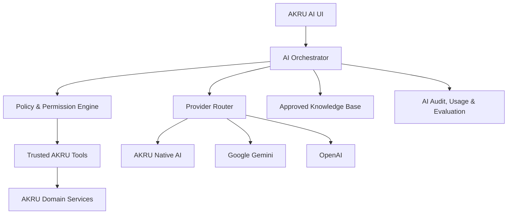
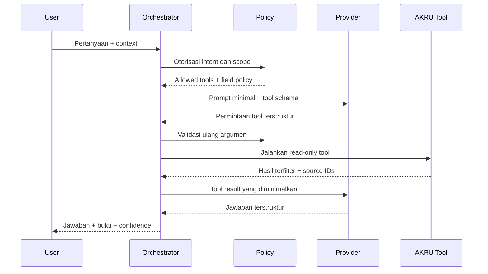

# Blueprint Modul: AKRU AI

> Companion blueprint untuk `Blueprint_AKRU_Antigravity.md`  
> Versi: 1.0  
> Status: Build-ready  
> Baseline: 16 September 2026

---

## 0. Cara Menggunakan Blueprint Ini

Dokumen ini adalah sumber acuan implementasi modul **AKRU AI**. Blueprint utama AKRU tetap menjadi sumber kebenaran untuk modul akuntansi, keuangan, pajak, persediaan, approval, audit, keamanan, dan aturan multi-tenant.

Jika terdapat perbedaan antara dua blueprint:

1. Aturan keamanan, isolasi tenant, posting akuntansi, pajak, approval, dan audit pada blueprint utama selalu menang.
2. Dokumen ini mengatur perilaku, antarmuka, data, provider, dan governance khusus fitur AI.
3. AI tidak boleh menjadi ketergantungan agar fitur inti AKRU dapat berjalan.

### 0.1 Prinsip yang Tidak Boleh Dilanggar

- Seluruh data perusahaan harus terisolasi menggunakan `company_id`.
- Pembatasan cabang, periode, role, dan izin pengguna harus diterapkan oleh server, bukan oleh prompt AI.
- AI hanya boleh membaca data melalui tool/API internal yang terdefinisi dan terotorisasi.
- Model AI tidak pernah menerima kredensial database dan tidak boleh membuat atau menjalankan SQL arbitrer.
- AI boleh menganalisis, menjelaskan, mengklasifikasi, memprediksi, memperingatkan, dan membuat usulan.
- AI tidak boleh mem-posting jurnal, menyetujui dokumen, membayar transaksi, mengubah pajak final, mengirim pelaporan pajak, atau menutup periode.
- Semua perubahan material harus melalui draft, konfirmasi eksplisit, approval, dan audit trail AKRU.
- Transaksi berstatus `posted` tetap immutable. Koreksi melalui reversal, retur, controlled void, atau adjustment yang sah.
- Kegagalan provider AI tidak boleh menghentikan proses bisnis inti. Sistem harus kembali ke AKRU Native AI, rule engine, atau proses manual.
- Ekspor data hanya menggunakan Excel dan PDF sesuai aturan produk AKRU; tidak menyediakan CSV.
- Jawaban pajak harus berbasis knowledge base yang disetujui, memiliki yurisdiksi dan tanggal berlaku, bukan semata-mata memori model.
- Jangan menyimpan atau menampilkan chain-of-thought. Simpan hanya ringkasan alasan, bukti, sumber, asumsi, dan hasil tool yang diperlukan untuk audit.

---

## 1. Overview

### 1.1 Deskripsi Singkat

**AKRU AI** adalah modul asisten cerdas di dalam AKRU yang membantu pengguna memahami data akuntansi, keuangan, pajak, dan bisnis menggunakan bahasa alami. Modul ini juga menjadi pemandu penggunaan software, mendeteksi transaksi tidak wajar, menjelaskan penyebab, dan menyusun rekomendasi tindakan yang tetap harus ditinjau manusia.

AKRU AI menggunakan satu lapisan orkestrasi dengan tiga provider yang dapat dipilih dan diatur per perusahaan: **AKRU Native AI (Gratis)**, **Google Gemini**, dan **OpenAI**. Semua provider memakai tool, aturan akses, semantic layer, knowledge base, serta workflow persetujuan AKRU yang sama.

### 1.2 Masalah yang Diselesaikan

- Pemilik bisnis kesulitan membaca laporan akuntansi dan menerjemahkannya menjadi keputusan.
- Tim keuangan menghabiskan waktu untuk pencarian transaksi, rekonsiliasi, analisis selisih, dan penyusunan penjelasan rutin.
- Pengguna tidak selalu mengetahui menu, prosedur, dan urutan kerja yang benar di AKRU.
- Risiko salah akun, transaksi ganda, lonjakan tidak wajar, dokumen hilang, keterlambatan pajak, dan fraud ringan terlambat diketahui.
- Konsultasi akuntansi, keuangan, dan pajak tidak selalu tersedia saat dibutuhkan.
- Jawaban AI generik sering tidak memahami data perusahaan, kebijakan internal, periode laporan, atau izin pengguna.
- Penggunaan AI eksternal dapat menimbulkan risiko privasi, biaya tidak terkontrol, dan ketergantungan provider.

### 1.3 Target User

- Pemilik bisnis dan direktur.
- CFO, finance manager, controller, dan treasury.
- Accounting manager, staf akuntansi, bookkeeper, dan auditor internal.
- Tax manager, staf pajak, dan konsultan pajak yang diberi akses.
- Branch manager dan operational manager.
- Inventory, purchasing, sales, dan collection team sesuai izin.
- Kantor akuntan atau konsultan yang mengelola beberapa perusahaan.
- Administrator AKRU, knowledge manager, compliance officer, dan superadmin platform.

### 1.4 Nilai Utama

- **Tanya data dengan bahasa biasa:** pengguna tidak perlu memahami query atau struktur database.
- **Jawaban yang dapat ditelusuri:** angka dan kesimpulan memiliki tautan ke laporan, transaksi, atau dokumen sumber.
- **Peringatan lebih dini:** anomali dideteksi terjadwal dan diberi prioritas berdasarkan risiko serta materialitas.
- **Panduan kontekstual:** langkah penggunaan menyesuaikan halaman, role, status dokumen, dan konfigurasi perusahaan.
- **Kontrol manusia:** AI memberi rekomendasi; pengguna yang berwenang mengambil keputusan.
- **Pilihan biaya dan privasi:** provider gratis bawaan tersedia, sementara Gemini dan OpenAI dapat dipakai untuk kemampuan generatif yang lebih luas.

### 1.5 Sasaran Bisnis

- Mengurangi waktu pencarian dan analisis data rutin minimal 50%.
- Mengurangi pertanyaan penggunaan software yang masuk ke support.
- Meningkatkan deteksi transaksi berisiko sebelum penutupan periode.
- Meningkatkan kualitas dan konsistensi review akuntansi serta pajak.
- Menjadi add-on bernilai tinggi tanpa menjadikan AI sebagai syarat penggunaan AKRU Standard.

### 1.6 Non-Goals

AKRU AI bukan:

- pengganti akuntan, auditor, penasihat hukum, atau konsultan pajak berlisensi;
- mesin keputusan otonom yang boleh mengubah pembukuan;
- layanan filing pajak langsung ke Coretax;
- chatbot yang dapat melihat semua data tanpa batas;
- antarmuka untuk menjalankan SQL bebas;
- mekanisme untuk menghindari approval atau segregation of duties;
- jaminan bahwa prediksi masa depan pasti benar.

---

## 2. Ruang Lingkup Kemampuan

### 2.1 Mode Asisten

AKRU AI menggunakan satu orchestrator dengan beberapa mode keahlian. Pengguna dapat memilih mode atau membiarkan sistem memilih berdasarkan intent.

| Mode | Fungsi utama | Contoh pertanyaan |
|---|---|---|
| Data Analyst | Mencari, membandingkan, dan menjelaskan data AKRU | “Mengapa laba Agustus turun dibanding Juli?” |
| Accounting Consultant | Membantu klasifikasi, jurnal, rekonsiliasi, closing, dan kebijakan akuntansi | “Akun apa yang cocok untuk biaya ini?” |
| Finance Consultant | Cash flow, modal kerja, rasio, budget, forecast, dan keputusan pembiayaan | “Apakah kas cukup untuk 60 hari?” |
| Tax Consultant | Rekonsiliasi fiskal, risiko pajak, bukti potong, PPN, dan kalender pajak | “Transaksi mana yang belum memiliki dokumen pajak?” |
| Business Advisor | Margin, pelanggan, produk, cabang, tren, dan skenario bisnis | “Produk mana yang sebaiknya diprioritaskan?” |
| AKRU Guide | Panduan langkah penggunaan software dan troubleshooting | “Bagaimana melakukan reversal invoice?” |
| Anomaly Investigator | Menjelaskan dan menindaklanjuti temuan anomali | “Mengapa transaksi ini ditandai berisiko tinggi?” |
| Document Assistant | Ekstraksi dokumen, pencocokan, dan usulan input | “Baca faktur ini dan cocokkan dengan PO.” |

### 2.2 Kemampuan Inti

1. Chat AI kontekstual.
2. Analisis data dan transaksi.
3. Konsultasi akuntansi.
4. Konsultasi keuangan.
5. Konsultasi pajak.
6. Konsultasi dan analisis bisnis.
7. Panduan penggunaan AKRU.
8. Deteksi dan investigasi anomali.
9. Analisis dokumen dan OCR.
10. Rekomendasi tindakan dan pembuatan draft yang terkontrol.

### 2.3 Kemampuan Tambahan yang Diperlukan

Kemampuan berikut ditambahkan agar modul dapat dipakai secara aman dan benar-benar berguna:

- **Evidence-grounded answer:** setiap klaim material menampilkan bukti data atau sumber pengetahuan.
- **Context-aware assistant:** memahami perusahaan, cabang, periode, halaman, dokumen, dan role aktif.
- **Missing-data diagnosis:** menjelaskan data apa yang belum tersedia sebelum memberi kesimpulan.
- **Proactive insight:** membuat ringkasan risiko dan perubahan penting secara terjadwal.
- **Scenario simulation:** membandingkan skenario bisnis tanpa mengubah data aktual.
- **Forecasting:** proyeksi kas, pendapatan, beban, AR collection, dan kebutuhan pembayaran dengan rentang ketidakpastian.
- **Closing assistant:** checklist kesiapan tutup buku dan daftar isu yang belum selesai.
- **Reconciliation assistant:** bantuan rekonsiliasi bank, subledger, pajak, persediaan, dan antar-cabang.
- **Policy checker:** memeriksa kepatuhan terhadap SOP dan kebijakan perusahaan.
- **Knowledge management:** dokumen bantuan, SOP, dan regulasi memiliki versi serta approval.
- **Feedback and evaluation:** jawaban AI dapat dinilai dan diuji ulang lintas provider.
- **Usage and cost control:** kuota, rate limit, biaya, dan fallback dapat diatur per perusahaan.
- **Human review queue:** semua saran material masuk ke antrean review yang dapat ditugaskan.

---

## 3. Arsitektur Tiga Provider

### 3.1 Daftar Provider Tetap

| Kode | Nama UI | Posisi | Karakteristik utama |
|---|---|---|---|
| `akru_native` | AKRU Native AI — Gratis | Default dan fallback | Rule engine, semantic metrics, knowledge retrieval, template response, statistik anomali; tanpa biaya API per token |
| `google_gemini` | Google Gemini | Provider eksternal opsional | Generative reasoning, tool/function calling, structured output, multimodal sesuai model yang dipilih |
| `openai` | OpenAI | Provider eksternal opsional | Responses API, function calling, structured output, multimodal sesuai model yang dipilih |

Provider keempat tidak boleh ditambahkan tanpa perubahan blueprint dan migrasi eksplisit.

### 3.2 Definisi “Gratis” untuk AKRU Native AI

AKRU Native AI tidak menimbulkan biaya API generatif per token. Namun, komputasi server, database, queue worker, penyimpanan, dan pemeliharaan tetap menjadi bagian dari biaya operasional AKRU.

AKRU Native AI bukan model bahasa besar yang dipaksakan berjalan di shared hosting. Implementasi awal terdiri dari:

- intent classifier;
- parser entitas, tanggal, periode, perusahaan, cabang, akun, dan nominal;
- semantic metric layer;
- approved query/tool catalog;
- rule engine akuntansi, pajak, dan workflow;
- retrieval dari knowledge base;
- statistical anomaly detection;
- response composer berbasis template;
- recommendation engine dengan aturan yang dapat dijelaskan.

AKRU Native AI wajib mampu menangani pertanyaan rutin dengan hasil deterministik. Jika pertanyaan membutuhkan penalaran generatif di luar cakupannya, sistem menjelaskan keterbatasan dan menawarkan Gemini atau OpenAI apabila diaktifkan.

Model open-source self-hosted dapat ditambahkan di masa depan sebagai mesin di belakang `akru_native`, tetapi harus berjalan pada server terpisah yang layak dan tidak mengubah kontrak provider di UI.

### 3.3 Prinsip Provider Abstraction

Semua provider menerima objek permintaan yang sudah dinormalisasi dan menghasilkan objek respons yang sama. Domain service tidak boleh bergantung langsung pada SDK Gemini atau OpenAI.

```php
interface AiProviderContract
{
    public function chat(AiRequest $request): AiResponse;
    public function stream(AiRequest $request): AiStream;
    public function capabilities(): ProviderCapabilities;
    public function healthCheck(): ProviderHealth;
}
```

Implementasi:

- `AkruNativeProvider`
- `GeminiProvider`
- `OpenAiProvider`

Objek `AiRequest` minimal memuat:

- `company_id`, `user_id`, `branch_scope`, dan `period_scope`;
- conversation context yang sudah diminimalkan;
- system policy version;
- user message;
- allowed tool definitions;
- required output schema;
- locale dan timezone;
- data sensitivity class;
- timeout dan budget;
- idempotency key.

Objek `AiResponse` minimal memuat:

- provider dan model aktual;
- jawaban terstruktur;
- citations;
- tool calls dan tool results yang diizinkan untuk audit;
- confidence dan risk level;
- usage, latency, dan estimated cost;
- finish reason;
- safety flags;
- provider request ID;
- fallback history.

### 3.4 Pemilihan Provider

Provider dapat diatur pada empat tingkat dengan urutan prioritas:

1. Override satu permintaan oleh pengguna yang memiliki izin.
2. Routing per capability perusahaan.
3. Default provider perusahaan.
4. Default platform, yaitu `akru_native`.

Contoh routing:

| Capability | Default | Alternatif | Alasan |
|---|---|---|---|
| Navigasi dan panduan AKRU | AKRU Native | Gemini/OpenAI | Cepat, deterministik, dokumentasi terkontrol |
| KPI dan laporan standar | AKRU Native | Gemini/OpenAI | Perhitungan dilakukan tool AKRU |
| Analisis naratif kompleks | OpenAI atau Gemini | Provider eksternal lain yang aktif | Membutuhkan generative reasoning |
| Ekstraksi dokumen | Gemini/OpenAI | Native OCR jika tersedia | Bergantung kemampuan multimodal model |
| Deteksi anomali terjadwal | AKRU Native | Provider eksternal untuk penjelasan | Deteksi tidak boleh bergantung pada API eksternal |
| Konsultasi pajak | Native retrieval + provider terpilih | Native | Sumber wajib dari knowledge base yang disetujui |

### 3.5 Fallback

- Timeout, rate limit, kuota habis, model nonaktif, atau kegagalan provider dapat memicu fallback.
- Fallback lintas provider eksternal hanya boleh terjadi jika admin perusahaan mengaktifkannya dan kebijakan data mengizinkan.
- Sistem tidak boleh diam-diam mengirim data ke provider eksternal yang belum disetujui perusahaan.
- `akru_native` selalu menjadi fallback terakhir untuk kemampuan yang didukung.
- Jika Native juga tidak dapat menjawab, tampilkan jawaban jujur, data yang kurang, dan langkah manual.
- Respons harus menunjukkan provider yang benar-benar menghasilkan jawaban.
- Kegagalan sebagian tidak boleh menghasilkan jawaban seolah-olah analisis lengkap.

### 3.6 Mode Kredensial Provider Eksternal

AKRU mendukung dua pola komersial:

- **Managed by AKRU:** kredensial platform, kuota dan biaya ditagihkan melalui paket AKRU AI.
- **BYOK — Bring Your Own Key:** perusahaan memasukkan API key sendiri, dienkripsi di server, dan biaya provider dibayar langsung oleh perusahaan.

Aturan:

- API key tidak pernah dikirim ke browser setelah disimpan.
- UI hanya menampilkan mask, status, tanggal verifikasi, dan empat karakter terakhir jika aman.
- Kredensial terenkripsi menggunakan application key/KMS yang sesuai.
- Rotasi, test connection, disable, revoke, dan audit wajib tersedia.
- Key tidak boleh tercatat di application log, exception trace, analytics, atau prompt.

### 3.7 Model Registry

- Jangan hard-code nama model sebagai aturan bisnis.
- Admin memilih model dari registry provider yang dikelola.
- Setiap record model memuat kemampuan, status, batas context, dukungan tool, structured output, vision, streaming, dan estimasi harga.
- Model dapat dinonaktifkan tanpa deployment aplikasi.
- Perubahan model aktif dicatat dalam audit log dan dapat dijadwalkan.
- Model yang deprecated tidak dapat dipilih untuk konfigurasi baru.

---

## 4. Arsitektur Sistem



### 4.1 Komponen Backend

1. `AiOrchestratorService`
   - mengelola context, intent, tool loop, citations, output schema, dan respons;
   - tidak memiliki akses langsung ke tabel domain.

2. `AiPolicyService`
   - memeriksa entitlement paket, permission, branch, period, sensitivity, dan consent;
   - menentukan tool serta field yang boleh digunakan.

3. `AiProviderRouter`
   - memilih provider/model;
   - mengelola fallback, retry, timeout, circuit breaker, dan budget.

4. `AiToolRegistry`
   - menyimpan definisi tool terstruktur;
   - memvalidasi argumen dan output;
   - memanggil domain service setelah authorization ulang.

5. `AiSemanticLayer`
   - mendefinisikan metrik, dimensi, kalender, mata uang, dan rumus baku;
   - mencegah model menghitung KPI dengan definisi yang tidak konsisten.

6. `AiKnowledgeService`
   - ingest, approval, indexing, retrieval, citation, effective dating, dan expiry dokumen.

7. `AiAnomalyService`
   - menjalankan rule/statistical detection;
   - menyimpan finding dan evidence;
   - mengelola assignment serta resolution.

8. `AiSuggestionService`
   - membuat saran dan draft terkontrol;
   - menghubungkan saran ke workflow approval.

9. `AiUsageService`
   - mencatat request, token/unit, biaya estimasi, latency, cache, dan kuota.

10. `AiEvaluationService`
    - menjalankan golden tests, regression, provider comparison, dan quality dashboard.

11. Queue workers
    - document ingestion;
    - embedding/indexing;
    - long-running analysis;
    - anomaly scan;
    - forecast;
    - report export;
    - evaluation batch.

### 4.2 Tool Loop yang Aman



Provider hanya mengusulkan pemanggilan tool. Aplikasi AKRU yang memvalidasi, menjalankan, dan mengembalikan hasilnya.

### 4.3 Batas Arsitektur

- Laravel modular monolith sesuai blueprint utama.
- MySQL sebagai transactional database.
- Redis direkomendasikan untuk cache, queue, rate limit, dan distributed lock saat pindah ke VPS; database queue dapat dipakai pada fase hosting awal.
- SSE digunakan untuk streaming chat jika infrastruktur mendukung; fallback ke non-streaming request tersedia.
- Long-running job tidak boleh ditahan dalam satu HTTP request.
- Provider SDK dibungkus adapter; domain module tidak boleh mengimpor SDK secara langsung.

---

## 5. Fitur Utama

### 5.1 Chat AI Kontekstual

**Apa yang dilakukan**

- Pengguna bertanya menggunakan Bahasa Indonesia atau Inggris.
- Chat mengetahui perusahaan, cabang, periode, halaman, dan record aktif setelah diberi izin.
- Pengguna dapat melampirkan transaksi, laporan, atau dokumen dari AKRU.
- Sistem mendeteksi intent dan memilih mode asisten.
- Pertanyaan ambigu memicu klarifikasi, bukan asumsi tersembunyi.
- Jawaban menampilkan provider, periode analisis, data freshness, confidence, sumber, dan tindakan yang disarankan.
- Riwayat percakapan dapat diberi nama, dicari, diarsipkan, dan diekspor ke PDF.
- Pengguna dapat memulai chat sementara yang tidak disimpan sebagai riwayat bisnis, tetapi audit keamanan dan penggunaan minimum tetap dipertahankan sesuai kebijakan.

**Contoh**

> User bisa bertanya “Mengapa kas turun minggu ini?”, sehingga AI mengambil cash movement yang diizinkan, menjelaskan penyebab terbesar, dan menautkan transaksi pembentuknya.

**Selesai jika**

- scope perusahaan/cabang/periode selalu terlihat;
- setiap angka material memiliki citation internal;
- user tanpa izin tidak dapat memperoleh data melalui prompt;
- respons dapat ditampilkan dalam struktur yang konsisten di tiga provider;
- kegagalan provider menghasilkan fallback atau error yang dapat ditindaklanjuti.

**Prioritas:** Wajib untuk rilis AKRU AI.

### 5.2 Natural-Language Data Analysis

**Apa yang dilakukan**

- Menjawab pertanyaan berdasarkan general ledger, subledger, penjualan, pembelian, bank, kas, persediaan, aset, pajak, budget, dan approval.
- Membandingkan periode, cabang, akun, produk, customer, vendor, channel, dan cost center.
- Menjelaskan variance nominal dan persentase.
- Membuat drill-down dari KPI ke dokumen sumber.
- Mengidentifikasi kontributor terbesar, tren, seasonality, konsentrasi, dan perubahan pola.
- Menghasilkan tabel atau chart hanya dari data hasil tool yang tervalidasi.
- Menyebutkan definisi metrik dan asumsi perhitungan.

**Contoh**

> User bisa bertanya “Bandingkan gross margin tiap cabang Q2 dan Q3,” sehingga AI menampilkan perbandingan, tiga penyebab perubahan terbesar, dan tautan ke laporan detail.

**Selesai jika**

- angka cocok dengan laporan resmi AKRU pada scope yang sama;
- filter aktif dapat dilihat dan diubah pengguna;
- hasil dapat diunduh sebagai Excel/PDF;
- tidak ada SQL generatif yang dieksekusi.

**Prioritas:** Wajib.

### 5.3 Konsultan Akuntansi

**Apa yang dilakukan**

- Menjelaskan perlakuan akuntansi berdasarkan kebijakan perusahaan dan referensi yang disetujui.
- Menyarankan akun, dimensi, cost center, tax mapping, dan deskripsi jurnal.
- Memeriksa keseimbangan debit-kredit dan kelengkapan supporting document.
- Membantu rekonsiliasi bank, AR, AP, persediaan, aset, pajak, dan intercompany.
- Menyusun closing checklist berdasarkan status data perusahaan.
- Menjelaskan dampak usulan jurnal terhadap laporan.
- Membuat draft jurnal atau adjustment hanya setelah konfirmasi dan jika user memiliki izin; draft tidak pernah langsung posted.

**Contoh**

> User bisa memilih transaksi lalu meminta “Periksa pencatatan ini,” sehingga AI menjelaskan akun yang digunakan, risiko salah klasifikasi, dan usulan koreksi sebagai draft.

**Selesai jika**

- rekomendasi menyebut kebijakan/sumber dan alasan singkat;
- semua draft memiliki link ke transaksi sumber dan pembuat;
- user reviewer dapat menerima, mengubah, atau menolak saran;
- tidak ada posting otomatis.

**Prioritas:** Wajib.

### 5.4 Konsultan Keuangan

**Apa yang dilakukan**

- Menganalisis likuiditas, profitabilitas, solvabilitas, efisiensi, modal kerja, dan cash conversion cycle.
- Menjelaskan posisi kas dan kebutuhan pendanaan.
- Membuat forecast berbasis data historis, jadwal AR/AP, budget, recurring transaction, dan asumsi user.
- Menjalankan skenario best/base/worst tanpa mengubah actual ledger.
- Memprioritaskan penagihan dan pembayaran berdasarkan jatuh tempo, risiko, diskon, dan batas kas.
- Memberi peringatan covenant atau threshold internal yang dikonfigurasi.

**Contoh**

> User bisa meminta “Buat skenario kas 13 minggu jika penjualan turun 10%,” sehingga sistem menghasilkan proyeksi, asumsi, range, dan minggu yang berpotensi defisit.

**Selesai jika**

- forecast memiliki tanggal pembuatan, model/versi, input, asumsi, dan range;
- actual tidak tertimpa oleh skenario;
- metrik memiliki definisi baku;
- hasil dapat direkonsiliasi ke sumber data.

**Prioritas:** Wajib untuk full module; forecast lanjutan dapat dirilis bertahap.

### 5.5 Konsultan Pajak

**Apa yang dilakukan**

- Menjawab pertanyaan berdasarkan regulasi dan knowledge document yang telah disetujui.
- Menampilkan yurisdiksi, tanggal berlaku, versi dokumen, dan tanggal terakhir ditinjau.
- Membantu mapping pajak transaksi tanpa menetapkan nilai final secara otomatis.
- Memeriksa kelengkapan NPWP/identitas, faktur pajak, bukti potong, objek pajak, tanggal, dan dokumen pendukung sesuai hak akses.
- Membandingkan catatan komersial dan fiskal.
- Menyusun kalender kewajiban serta reminder.
- Mengidentifikasi transaksi yang membutuhkan review pajak.
- Menyiapkan data Coretax-ready sesuai blueprint utama; tidak melakukan filing langsung.

**Contoh**

> User bisa bertanya “Transaksi apa yang berisiko belum dipotong pajak bulan ini?”, sehingga AI menampilkan daftar kandidat, alasan rule, nilai material, dan dokumen yang belum tersedia.

**Selesai jika**

- jawaban material selalu memiliki citation regulasi/kebijakan;
- sistem menolak kesimpulan pasti ketika sumber kadaluarsa atau data tidak cukup;
- perubahan mapping pajak hanya berupa draft/review;
- ada disclaimer yang proporsional, tidak mengganggu setiap jawaban rutin.

**Prioritas:** Wajib.

### 5.6 Business Advisor

**Apa yang dilakukan**

- Mengidentifikasi produk, layanan, pelanggan, vendor, dan cabang yang paling menguntungkan atau berisiko.
- Menganalisis margin, diskon, return, churn proxy, repeat order, dan konsentrasi pendapatan.
- Menyusun rekomendasi tindakan berdasarkan target yang ditentukan user.
- Membandingkan scenario pricing, volume, biaya, dan working capital.
- Membuat executive summary harian, mingguan, atau bulanan.

**Contoh**

> User bisa meminta “Pelanggan mana yang omzetnya besar tetapi menekan kas?”, sehingga AI menggabungkan revenue, margin, aging, keterlambatan, dan retur untuk menyusun prioritas.

**Selesai jika**

- rekomendasi memisahkan fakta, inferensi, dan asumsi;
- target optimasi disebutkan secara eksplisit;
- tidak memberikan keputusan kredit final tanpa approval.

**Prioritas:** Wajib untuk full module.

### 5.7 Panduan Penggunaan AKRU

**Apa yang dilakukan**

- Menjawab cara menggunakan modul, menu, field, workflow, dan report AKRU.
- Membaca context halaman aktif tanpa mengambil data lebih dari yang dibutuhkan.
- Memberikan langkah bernomor, prasyarat, permission yang diperlukan, hasil yang diharapkan, dan cara membatalkan/koreksi.
- Menampilkan tombol **Buka Halaman**, **Lihat Panduan**, atau **Hubungi Admin**.
- Menjelaskan mengapa tombol tidak tersedia berdasarkan status dan role, tanpa membocorkan konfigurasi sensitif.
- Membantu onboarding berdasarkan role.
- Mendiagnosis error menggunakan error code yang sudah disanitasi.

**Contoh**

> User bisa bertanya “Bagaimana membatalkan invoice yang sudah posted?”, sehingga AI menjelaskan bahwa record tidak dapat diedit, lalu memandu reversal/credit note sesuai izin.

**Selesai jika**

- langkah sesuai route dan versi produk saat ini;
- deep link membuka tenant dan halaman yang benar;
- AI tidak melakukan aksi destruktif melalui link;
- artikel bantuan memiliki owner dan version.

**Prioritas:** Wajib.

### 5.8 Deteksi dan Investigasi Anomali

**Apa yang dilakukan**

- Menjalankan rule deterministik, statistik, tren historis, dan peer-group internal.
- Memberi severity, confidence, materiality, evidence, dan kemungkinan penyebab.
- Mengelompokkan temuan duplikat agar user tidak dibanjiri alert.
- Memungkinkan assignment, komentar, snooze, false positive, accepted risk, dan resolution.
- Menjalankan scan terjadwal, saat import, sebelum approval, sebelum posting tertentu, dan sebelum closing.
- Provider eksternal dapat membantu membuat penjelasan, tetapi status finding ditentukan oleh engine dan reviewer.

Kategori awal:

- duplikasi invoice/pembayaran/jurnal;
- nomor dokumen lompat atau berulang;
- transaksi pada tanggal/jam tidak biasa;
- transaksi mendekati atau memecah batas approval;
- nominal bulat atau pola nominal tidak lazim;
- akun, vendor, customer, atau bank baru dengan nilai material;
- perubahan rekening bank vendor;
- jurnal manual ke akun sensitif;
- debit-kredit atau subledger tidak konsisten;
- transaksi backdated/future-dated;
- lonjakan atau penurunan terhadap baseline;
- margin negatif atau outlier;
- stok negatif, shrinkage, atau perbedaan valuasi;
- pembayaran ganda atau overpayment;
- piutang/hutang sangat lewat jatuh tempo;
- transaksi pajak tanpa dokumen yang dibutuhkan;
- user yang membuat dan memproses tahapan yang berpotensi melanggar segregation of duties;
- reversal atau void yang tidak biasa;
- login, export, atau aktivitas data yang berisiko jika security telemetry tersedia.

**Selesai jika**

- setiap finding dapat ditelusuri ke rule dan evidence;
- reviewer dapat menandai false positive untuk tuning;
- temuan tidak mengubah transaksi otomatis;
- scan dapat dipantau, diulang, dan diaudit;
- alert rate dan precision dapat diukur.

**Prioritas:** Wajib.

### 5.9 Document AI dan OCR

**Apa yang dilakukan**

- Membaca invoice, receipt, purchase order, delivery document, statement, dan dokumen pajak yang didukung.
- Mengekstrak header, line item, nominal, tanggal, identitas, dan reference number.
- Menampilkan confidence per field.
- Mencocokkan PO–goods receipt–invoice atau dokumen lain yang relevan.
- Menandai perbedaan kuantitas, harga, pajak, tanggal, dan vendor.
- Membuat draft input setelah user memeriksa hasil.

**Selesai jika**

- dokumen asli selalu tersimpan sebagai evidence sesuai kebijakan;
- field confidence rendah wajib ditandai;
- user dapat membandingkan dokumen dan hasil ekstraksi;
- tidak ada hasil OCR yang langsung menjadi posted transaction.

**Prioritas:** Wajib untuk full module; model/format dokumen ditambah bertahap.

### 5.10 Proactive Insight dan Briefing

**Apa yang dilakukan**

- Menampilkan insight penting setelah login dan pada dashboard.
- Membuat briefing periodik berdasarkan jadwal dan preferensi role.
- Mengutamakan perubahan yang material dan dapat ditindaklanjuti.
- Menghindari duplikasi insight yang sudah dibaca/diselesaikan.
- Menyediakan digest di aplikasi; kanal eksternal hanya ditambahkan melalui integrasi dan consent terpisah.

**Selesai jika**

- setiap insight memiliki alasan muncul;
- pengguna dapat mengatur frekuensi dan kategori;
- data sensitif tidak ditampilkan pada notification preview;
- insight dapat dibuka ke analisis lengkap.

**Prioritas:** Wajib untuk full module.

### 5.11 Closing Assistant

**Apa yang dilakukan**

- Memeriksa checklist rekonsiliasi, transaksi draft, approval tertunda, nomor dokumen, pajak, inventory, fixed asset, dan jurnal berisiko.
- Menampilkan readiness score yang terdiri dari rule transparan.
- Menjelaskan blocker dan owner yang harus menindaklanjuti.
- Membandingkan status dengan periode sebelumnya.
- Membuat daftar pekerjaan; AI tidak menutup periode.

**Selesai jika**

- score dapat dijelaskan sampai ke tiap komponen;
- blocker tertaut ke record/work queue;
- closing tetap membutuhkan role dan approval resmi.

**Prioritas:** Wajib untuk full module.

---

## 6. Desain Chat dan Pengalaman Pengguna

### 6.1 Entry Point

- Tombol **AKRU AI** persisten pada sidebar/topbar.
- Drawer kontekstual untuk pertanyaan cepat tanpa meninggalkan halaman.
- Halaman penuh untuk analisis, tabel besar, chart, dan riwayat.
- Tombol **Tanya AKRU AI** pada transaksi, laporan, anomaly, dan help article.
- Shortcut keyboard opsional.

### 6.2 Header Chat

Wajib menampilkan:

- perusahaan aktif;
- cabang/scope aktif;
- periode aktif;
- provider dan model;
- mode asisten;
- indikator online;
- indikator data freshness;
- tombol percakapan baru dan history.

Perubahan company context harus memulai percakapan baru atau meminta konfirmasi. Satu percakapan tidak boleh menggabungkan data dua perusahaan.

### 6.3 Composer

- Text area multi-line.
- Attachment picker hanya untuk record/dokumen yang user dapat akses.
- Command/suggested prompts berdasarkan halaman.
- Provider selector jika diizinkan.
- Tombol stop generation.
- Draft prompt lokal ketika koneksi putus; jangan kirim otomatis saat online kembali.
- Peringatan sebelum data sensitif dikirim ke provider eksternal jika consent belum diberikan.

### 6.4 Struktur Jawaban

Urutan standar:

1. Jawaban singkat.
2. Key numbers atau conclusion cards.
3. Temuan dan penjelasan.
4. Sumber/bukti.
5. Asumsi dan data yang kurang.
6. Rekomendasi langkah berikutnya.
7. Tombol tindakan aman.
8. Confidence, risk, provider, dan timestamp.

### 6.5 Jenis Tombol Tindakan

| Kategori | Contoh | Aturan |
|---|---|---|
| Navigasi | Buka transaksi, buka report | Boleh langsung jika user memiliki akses |
| Filter | Terapkan periode, tampilkan cabang | Hanya mengubah view |
| Analisis | Jalankan scan, bandingkan periode | Read-only dan logged |
| Draft | Buat draft jurnal, buat task review | Wajib konfirmasi dan permission |
| Material | Submit approval, posting, closing | Tidak dieksekusi AI; arahkan ke workflow resmi |

### 6.6 Citation

Citation internal harus memuat:

- tipe sumber;
- ID atau nomor dokumen yang aman ditampilkan;
- label sumber;
- periode/tanggal;
- deep link;
- snapshot/version atau data-as-of jika relevan.

Citation knowledge harus memuat:

- judul;
- pemilik/penerbit;
- versi;
- tanggal berlaku;
- yurisdiksi;
- bagian atau halaman;
- status approval.

### 6.7 Feedback

- Helpful / Not helpful.
- Kategori masalah: angka salah, sumber salah, tidak relevan, terlalu umum, unsafe, lambat, atau lainnya.
- Komentar opsional.
- Tombol **Laporkan Jawaban** untuk kasus sensitif.
- Feedback tidak langsung mengubah prompt produksi; masuk review dan evaluation set.

---

## 7. Input Data ke AKRU AI

### 7.1 Data Internal Terstruktur

- Chart of accounts dan mapping.
- General ledger dan journal lines.
- AR, AP, invoice, credit note, receipt, payment.
- Bank account, bank transaction, dan reconciliation.
- Sales, purchase, return, delivery, dan order.
- Inventory movement, cost, stock opname, dan valuation.
- Fixed asset, depreciation, disposal.
- Tax transaction, mapping, tax document, dan reconciliation.
- Budget, forecast, target, dan actual.
- Customer, vendor, product, service, branch, department, project, dan cost center.
- Currency, exchange rate, period, fiscal calendar.
- Approval history, workflow status, comments, dan exception.
- User/role/permission metadata dalam bentuk minimum yang diperlukan.
- Audit event dan activity metadata yang relevan.

### 7.2 Data Tidak Terstruktur

- Help center AKRU.
- SOP penggunaan aplikasi.
- Kebijakan akuntansi perusahaan.
- Kebijakan keuangan, approval, dan procurement.
- Regulasi dan panduan pajak yang disetujui.
- Dokumen transaksi yang diunggah.
- Catatan reviewer dan resolution knowledge.

### 7.3 Context Setiap Permintaan

- `company_id` wajib dan diambil dari session server.
- user, role, dan permission efektif.
- branch scope.
- period/date scope.
- currency dan timezone.
- route/page/module aktif.
- selected record IDs.
- language dan preferred detail level.
- provider consent dan data policy.
- data freshness timestamp.

### 7.4 Data Quality Gate

Sebelum membuat kesimpulan, sistem memeriksa:

- periode dan ledger sudah tersedia;
- transaksi draft vs posted dipisahkan;
- currency conversion konsisten;
- opening balance tersedia;
- subledger terhubung;
- master data penting tidak kosong;
- report scope sama dengan scope pertanyaan;
- knowledge source belum expired;
- data yang digunakan tidak stale.

Jika quality gate gagal, jawaban wajib menampilkan keterbatasan dan langkah memperbaiki data.

---

## 8. Output yang Dihasilkan

| Output | Isi minimum | Format |
|---|---|---|
| Chat answer | Jawaban, bukti, asumsi, confidence | UI/PDF |
| Analysis card | KPI, perubahan, kontributor, drill-down | UI |
| Analysis report | Scope, metode, tabel, chart, temuan, rekomendasi | PDF/Excel |
| Anomaly finding | Rule, severity, confidence, materiality, evidence, status | UI/PDF/Excel |
| Forecast | Actual, forecast, range, asumsi, model version | UI/PDF/Excel |
| Reconciliation suggestion | Kandidat match, selisih, confidence | UI/Excel |
| Accounting suggestion | Account/dimension/journal draft, reason, impact | UI/PDF |
| Tax review list | Candidate, rule, evidence, deadline, reviewer | UI/PDF/Excel |
| AKRU guide | Prasyarat, langkah, expected result, deep link | UI/PDF |
| Closing checklist | Status, blocker, owner, due date | UI/PDF/Excel |
| Executive briefing | Perubahan penting, risiko, opportunity, action | UI/PDF |
| Document extraction | Field, value, confidence, source region | UI/Excel |

Tidak ada output CSV.

---

## 9. Trusted Tool Catalog

### 9.1 Aturan Tool

- Tool harus memiliki JSON schema yang ketat.
- Setiap tool memiliki permission, sensitivity, row limit, timeout, dan audit policy.
- Server mengisi `company_id`; model tidak boleh mengirim atau menggantinya.
- Tool harus memvalidasi branch dan period.
- Output hanya memuat field yang dibutuhkan.
- Panggilan tool harus idempotent jika membuat draft.
- Tool read-only dan draft/proposal dipisahkan.
- Tidak ada tool `run_sql`, `execute_code`, `post_journal`, `approve`, `pay`, `close_period`, atau `file_tax`.

### 9.2 Tool Read-Only Minimum

- `get_company_context`
- `get_financial_summary`
- `get_trial_balance`
- `get_balance_sheet`
- `get_profit_and_loss`
- `get_cash_flow`
- `get_general_ledger`
- `search_transactions`
- `get_transaction_detail`
- `get_ar_aging`
- `get_ap_aging`
- `get_bank_reconciliation_status`
- `get_inventory_summary`
- `get_inventory_valuation`
- `get_fixed_asset_summary`
- `get_budget_vs_actual`
- `get_tax_summary`
- `get_tax_reconciliation`
- `get_approval_status`
- `get_closing_readiness`
- `calculate_financial_ratios`
- `compare_periods`
- `run_scenario_preview`
- `get_feature_help`
- `search_approved_knowledge`
- `get_anomaly_finding`
- `run_anomaly_scan_preview`

### 9.3 Tool Proposal/Draft

- `create_analysis_task`
- `create_review_task`
- `create_journal_draft_suggestion`
- `create_account_mapping_suggestion`
- `create_tax_mapping_suggestion`
- `create_reconciliation_suggestion`
- `create_document_entry_draft`
- `create_follow_up_checklist`
- `export_analysis_pdf`
- `export_analysis_excel`

Setiap tool draft memerlukan:

- user confirmation;
- permission khusus;
- source references;
- idempotency key;
- audit event;
- status awal `draft` atau `suggested`;
- link menuju layar review.

---

## 10. Semantic Metric Layer

### 10.1 Tujuan

Semantic layer memastikan “revenue”, “gross margin”, “cash balance”, “overdue AR”, dan metrik lain dihitung konsisten, tidak didefinisikan sendiri oleh model.

### 10.2 Definisi Metrik

Setiap metrik menyimpan:

- code dan display name;
- business definition;
- formula/version;
- source module dan field;
- allowed dimensions;
- currency behavior;
- treatment draft/posted;
- period behavior;
- permission class;
- owner dan approver;
- effective date;
- test cases.

### 10.3 Dimensi Standar

- date/fiscal period;
- company dan branch;
- chart of account;
- customer/vendor;
- product/service/category;
- project/department/cost center;
- salesperson/channel;
- currency;
- document status;
- tax type.

### 10.4 Aturan Perhitungan

- Posted-only menjadi default untuk laporan resmi.
- Draft hanya disertakan jika user meminta dan diberi label jelas.
- Perbandingan periode menggunakan kalender fiskal perusahaan.
- Nilai multi-currency menyebut reporting currency dan rate source.
- Rounding mengikuti konfigurasi laporan AKRU.
- Semua hasil agregat dapat di-drill-down.

---

## 11. Knowledge Base dan RAG

### 11.1 Jenis Knowledge

1. Global AKRU product knowledge.
2. Global approved accounting knowledge.
3. Global/jurisdiction-specific tax knowledge.
4. Company accounting policy.
5. Company SOP dan approval policy.
6. Resolution knowledge dari kasus yang sudah disetujui.

### 11.2 Lifecycle Dokumen

`draft → in_review → approved → effective → superseded/expired → archived`

Dokumen yang belum `approved/effective` tidak boleh dipakai sebagai sumber jawaban produksi, kecuali pada mode preview oleh knowledge reviewer.

### 11.3 Metadata Wajib

- title dan source type;
- owner dan reviewer;
- company scope atau global scope;
- jurisdiction;
- version;
- published/effective/expiry date;
- language;
- sensitivity classification;
- allowed roles;
- checksum;
- supersedes/superseded_by;
- ingestion dan approval status.

### 11.4 Retrieval

- Filter permission dan tenant dilakukan sebelum ranking.
- Gunakan hybrid keyword/full-text dan semantic retrieval jika embeddings aktif.
- MySQL FULLTEXT menjadi baseline yang cPanel-friendly.
- Vector database atau vector extension bersifat opsional ketika skala meningkat.
- Chunk menyimpan document/version reference dan section locator.
- Model hanya menerima potongan yang relevan dan diperbolehkan.
- Citation wajib untuk jawaban pajak, kebijakan, dan langkah produk.

### 11.5 Perlindungan Prompt Injection

- Dokumen dianggap data tidak tepercaya, bukan system instruction.
- Instruksi yang tertulis di dokumen tidak boleh mengubah policy, permission, atau tool list.
- Konten berisiko ditandai saat ingestion.
- HTML/script/macro dibersihkan.
- Model diberi pemisah tegas antara instruction dan retrieved content.
- Tool call selalu divalidasi ulang oleh server.

---

## 12. Anomaly Engine

### 12.1 Jenis Detektor

| Detektor | Contoh | Penjelasan |
|---|---|---|
| Deterministic rule | Duplicate invoice number | Mudah diaudit dan menjadi fondasi |
| Threshold | Nilai di atas batas material | Diatur per perusahaan/branch |
| Statistical | Z-score/IQR terhadap histori | Untuk outlier numerik |
| Time-series | Perubahan tren/seasonality | Untuk lonjakan/penurunan |
| Sequence | Nomor dokumen hilang | Untuk kelengkapan dan kontrol |
| Relationship | Vendor-bank-user tidak lazim | Untuk pola hubungan |
| Policy | Melanggar SOP/approval | Berdasarkan policy yang disetujui |
| Cross-module | Invoice, payment, tax tidak konsisten | Memakai referensi antarmodul |

Benford atau teknik statistik lain hanya menjadi indikator awal, bukan bukti fraud.

### 12.2 Skor Temuan

Skor risiko 0–100 dihitung oleh engine AKRU berdasarkan:

- severity rule;
- confidence;
- nilai/materiality;
- frekuensi dan repetisi;
- proximity ke closing/deadline;
- akun atau pihak sensitif;
- kualitas evidence;
- historical resolution.

Label:

- 0–19: Info
- 20–39: Low
- 40–59: Medium
- 60–79: High
- 80–100: Critical

Threshold dapat dikonfigurasi tetapi perubahan harus diaudit.

### 12.3 Status Temuan

`open → assigned → in_review → confirmed_issue/false_positive/accepted_risk → resolved → reopened`

### 12.4 Evidence

Setiap finding menyimpan:

- affected record references;
- observed value dan expected/baseline;
- rule/version;
- data snapshot timestamp;
- calculation summary;
- related findings;
- AI explanation version;
- reviewer dan resolution.

### 12.5 Jadwal Scan

- near-real-time setelah import atau perubahan penting;
- daily incremental;
- weekly comprehensive;
- pre-approval untuk rule tertentu;
- pre-closing full scan;
- on-demand oleh user berizin.

### 12.6 Tuning

- Rule dapat diuji dalam shadow mode sebelum aktif.
- Admin melihat alert volume, precision proxy, false-positive rate, dan processing time.
- Feedback reviewer tidak otomatis mengubah rule produksi.
- Perubahan rule memerlukan versioning, test, dan approval.

---

## 13. Suggestions dan Human-in-the-Loop

### 13.1 Jenis Saran

- account mapping;
- tax mapping;
- customer/vendor match;
- bank reconciliation match;
- journal draft;
- document entry draft;
- anomaly resolution step;
- collection/payment priority;
- closing task;
- scenario action plan.

### 13.2 Status Saran

`generated → awaiting_review → accepted/edited/rejected/expired → converted_to_draft`

Saran yang diterima belum berarti transaksi posted.

### 13.3 Data Wajib Saran

- source record IDs;
- provider/model dan prompt policy version;
- tool result versions;
- suggested values;
- confidence;
- reason summary;
- impact preview;
- reviewer;
- accepted/edited/rejected timestamp;
- downstream draft ID jika dibuat.

### 13.4 Approval

- AI tidak boleh menjadi approver.
- Pembuat saran tidak dihitung sebagai reviewer manusia.
- Segregation of duties tetap mengikuti policy AKRU.
- Materiality threshold menentukan tingkat approval.
- Perubahan hasil saran oleh user disimpan sebagai audit diff.

---

## 14. Halaman dan Tampilan

### 14.1 AKRU AI Chat

Isi:

- conversation sidebar;
- context/provider/mode header;
- message timeline;
- source and evidence drawer;
- suggested prompt;
- composer dan attachment;
- feedback;
- export PDF;
- pinned insight.

Tampilan desktop: tiga panel opsional—history, chat, evidence.  
Tampilan mobile: satu panel dengan drawer history/evidence.

### 14.2 AI Insights Dashboard

Isi:

- executive briefing;
- critical/high anomalies;
- cash outlook;
- margin/revenue changes;
- AR/AP priorities;
- tax/closing deadline;
- saved analysis;
- “ask about this” action.

Semua card menampilkan data-as-of dan scope.

### 14.3 Anomaly Center

Isi:

- severity summary;
- filters;
- finding table;
- evidence drawer;
- assignment dan due date;
- comments;
- related transactions;
- status/resolution form;
- scan history;
- export PDF/Excel.

### 14.4 Suggestion Review Queue

Isi:

- jenis saran;
- before/after atau current/suggested value;
- reason, confidence, dan impact;
- evidence;
- accept/edit/reject;
- convert to draft;
- bulk review hanya untuk low-risk suggestions dan permission khusus.

### 14.5 Document AI Review

Isi:

- viewer dokumen asli;
- extracted fields;
- confidence per field;
- line items;
- match candidates;
- mismatch highlight;
- validation error;
- create draft.

### 14.6 Forecast dan Scenario Studio

Isi:

- base data range;
- assumption editor;
- scenario tabs;
- chart actual/forecast/range;
- cash deficit markers;
- driver explanation;
- save/version/export.

### 14.7 Closing Assistant

Isi:

- readiness score;
- checklist by module;
- blocking issues;
- owner/due date;
- prior-period comparison;
- run checks;
- open work queue.

### 14.8 Knowledge Base

Isi:

- document list;
- filters by type/status/jurisdiction/company;
- editor/upload;
- version diff;
- preview chunks/citations;
- review and approval;
- effective/expiry scheduling;
- ingestion/indexing status.

### 14.9 Provider & Model Settings

Isi:

- three-provider cards;
- enabled status;
- managed/BYOK mode;
- masked credential;
- test connection;
- model registry;
- default provider;
- routing per capability;
- fallback consent;
- data sharing policy;
- timeout and budget.

### 14.10 AI Usage & Cost

Isi:

- requests, tokens/units, latency, success, cache hit;
- estimated cost by provider/model/user/capability;
- budget and quota;
- threshold alerts;
- trend chart;
- top expensive use cases;
- export PDF/Excel.

### 14.11 Prompt & Evaluation Admin

Isi:

- prompt policy/template list;
- versions and diff;
- test cases;
- sandbox run against three providers;
- score comparison;
- approval and rollout;
- rollback.

Hanya platform AI admin/authorized internal role. Prompt rahasia tidak ditampilkan ke tenant user.

### 14.12 AI Audit Log

Isi:

- request/event ID;
- actor/company;
- capability;
- provider/model;
- tools called;
- source references;
- policy and prompt version;
- result status;
- usage/latency;
- fallback;
- review/action outcome;
- sanitized error.

Prompt/result sensitif ditampilkan sesuai izin dan retention policy, bukan sebagai log mentah tanpa batas.

---

## 15. Permission dan Role

### 15.1 Permission Minimum

- `ai.chat.use`
- `ai.provider.select`
- `ai.data.analyze`
- `ai.accounting.consult`
- `ai.finance.consult`
- `ai.tax.consult`
- `ai.business.consult`
- `ai.guide.use`
- `ai.document.extract`
- `ai.anomaly.view`
- `ai.anomaly.run`
- `ai.anomaly.assign`
- `ai.anomaly.resolve`
- `ai.suggestion.view`
- `ai.suggestion.review`
- `ai.draft.create`
- `ai.forecast.view`
- `ai.forecast.manage`
- `ai.knowledge.view`
- `ai.knowledge.manage`
- `ai.knowledge.approve`
- `ai.provider.manage`
- `ai.usage.view`
- `ai.audit.view`
- `ai.evaluation.manage`

### 15.2 Prinsip Akses

- Permission AI tidak memperluas permission modul asal.
- User yang tidak boleh melihat payroll tidak dapat memperoleh payroll melalui chat.
- Aggregation tidak boleh digunakan untuk menyimpulkan data sensitif jika grup terlalu kecil; terapkan minimum group size bila relevan.
- Provider/model selector dapat disembunyikan dari user biasa.
- Knowledge company-specific hanya tersedia dalam tenant tersebut.
- Impersonation/support access mengikuti kebijakan support yang ketat dan dicatat.

---

## 16. Model Data

Seluruh tabel tenant wajib memiliki `company_id` dan index yang sesuai. Tabel global harus dinyatakan eksplisit dan tidak menyimpan data transaksi tenant.

### 16.1 Provider dan Konfigurasi

#### `ai_providers` — global

- `id`, `code`, `name`
- `adapter_class`
- `is_active`
- `capability_flags_json`
- timestamps

#### `ai_provider_models` — global

- `id`, `provider_id`, `model_code`, `display_name`
- `capability_flags_json`
- `context_limit`, `output_limit`
- `pricing_metadata_json`
- `status`, `deprecated_at`
- timestamps

#### `ai_company_provider_settings`

- `id`, `company_id`, `provider_id`
- `is_enabled`, `credential_mode`
- `encrypted_credential_ref`
- `default_model_id`
- `data_policy_json`
- `fallback_allowed`
- `last_tested_at`, `last_test_status`
- `created_by`, `updated_by`, timestamps

#### `ai_capability_routes`

- `id`, `company_id`, `capability_code`
- `primary_provider_id`, `primary_model_id`
- `fallback_provider_id`, `fallback_model_id`
- `max_cost_per_request`, `timeout_seconds`
- `is_active`, timestamps

### 16.2 Conversation

#### `ai_conversations`

- `id`, `company_id`, `user_id`
- `title`, `mode`
- `branch_scope_json`, `period_scope_json`
- `provider_preference`
- `status`, `last_message_at`
- `retention_expires_at`
- timestamps

#### `ai_messages`

- `id`, `company_id`, `conversation_id`
- `role`, `message_type`
- `content_encrypted` atau secure content reference
- `structured_content_json`
- `provider_id`, `model_id`
- `confidence`, `risk_level`
- `data_as_of`, `status`
- `parent_message_id`, timestamps

#### `ai_message_citations`

- `id`, `company_id`, `message_id`
- `source_type`, `source_id`
- `source_version`, `label`
- `locator_json`, `deep_link`
- `data_as_of`, timestamps

#### `ai_tool_calls`

- `id`, `company_id`, `message_id`
- `tool_code`, `tool_version`
- `arguments_redacted_json`
- `result_summary_json`
- `authorization_result`
- `duration_ms`, `status`, `error_code`
- timestamps

### 16.3 Usage dan Audit

#### `ai_usage_events`

- `id`, `company_id`, `user_id`
- `provider_id`, `model_id`, `capability_code`
- `request_units`, `input_tokens`, `output_tokens`
- `estimated_cost`, `currency`
- `cache_hit`, `latency_ms`, `status`
- `request_id`, timestamps

#### `ai_consent_logs`

- `id`, `company_id`, `user_id`
- `provider_id`, `consent_type`, `policy_version`
- `granted`, `granted_at`, `revoked_at`
- metadata, timestamps

#### `ai_redaction_events`

- `id`, `company_id`, `request_id`
- `rule_code`, `field_type`, `action`
- `count`, timestamps

### 16.4 Knowledge

#### `ai_knowledge_sources`

- `id`, nullable `company_id`
- `source_type`, `name`, `owner_id`
- `jurisdiction`, `sensitivity`
- `status`, timestamps

#### `ai_knowledge_documents`

- `id`, nullable `company_id`, `source_id`
- `title`, `version`, `language`
- `effective_at`, `expires_at`
- `status`, `checksum`
- `file_reference`, `supersedes_id`
- `created_by`, `reviewed_by`, `approved_by`
- timestamps

#### `ai_knowledge_chunks`

- `id`, nullable `company_id`, `document_id`
- `section_path`, `chunk_text_encrypted`
- `search_text`, `embedding_reference`
- `token_count`, `metadata_json`
- timestamps

### 16.5 Suggestions

#### `ai_suggestions`

- `id`, `company_id`, `suggestion_type`
- `source_type`, `source_id`
- `provider_id`, `model_id`
- `policy_version`, `payload_json`
- `reason_summary`, `confidence`, `risk_level`
- `status`, `expires_at`
- `created_by`, timestamps

#### `ai_suggestion_reviews`

- `id`, `company_id`, `suggestion_id`
- `reviewer_id`, `decision`
- `edited_payload_json`, `comment`
- `converted_draft_type`, `converted_draft_id`
- timestamps

### 16.6 Anomaly

#### `ai_anomaly_rules`

- `id`, nullable `company_id`
- `code`, `name`, `category`
- `version`, `detector_type`
- `configuration_json`
- `base_severity`, `is_active`, `shadow_mode`
- `effective_at`, `approved_by`, timestamps

#### `ai_anomaly_runs`

- `id`, `company_id`, `rule_set_version`
- `trigger_type`, `scope_json`
- `started_at`, `finished_at`
- `status`, `records_scanned`, `findings_count`
- `error_summary`, timestamps

#### `ai_anomaly_findings`

- `id`, `company_id`, `run_id`, `rule_id`
- `fingerprint`, `category`
- `severity`, `risk_score`, `confidence`
- `materiality_value`, `currency`
- `title`, `explanation_summary`
- `status`, `assignee_id`, `due_at`
- `resolved_by`, `resolved_at`, `resolution_code`
- timestamps

#### `ai_anomaly_evidence`

- `id`, `company_id`, `finding_id`
- `source_type`, `source_id`
- `observed_json`, `expected_json`
- `snapshot_at`, timestamps

### 16.7 Prompt dan Evaluation

#### `ai_prompt_templates` — global atau company override terkontrol

- `id`, `code`, `capability_code`
- `scope_type`, nullable `company_id`
- `status`, `current_version_id`
- timestamps

#### `ai_prompt_versions`

- `id`, `template_id`, `version`
- `system_policy_ref`, `template_encrypted`
- `output_schema_json`, `change_summary`
- `created_by`, `approved_by`, `effective_at`
- timestamps

#### `ai_evaluation_cases`

- `id`, `suite_code`, nullable `company_id`
- `capability_code`, `input_fixture_encrypted`
- `expected_assertions_json`
- `sensitivity`, `status`, timestamps

#### `ai_evaluation_runs` dan `ai_evaluation_results`

- provider/model/prompt version;
- pass/fail dan score per rubric;
- citation/tool/security assertions;
- latency dan estimated cost;
- regression comparison.

### 16.8 Feedback dan Incident

#### `ai_feedback`

- `id`, `company_id`, `message_id`, `user_id`
- `rating`, `category`, `comment`
- `review_status`, timestamps

#### `ai_incidents`

- `id`, nullable `company_id`
- `incident_type`, `severity`
- `provider_id`, `request_id`
- `summary`, `containment`, `status`
- `reported_by`, `resolved_by`
- timestamps

---

## 17. API Blueprint

Semua endpoint memakai authentication, tenant middleware, authorization, rate limiting, request ID, dan audit.

### 17.1 Chat

- `POST /api/v1/ai/conversations`
- `GET /api/v1/ai/conversations`
- `GET /api/v1/ai/conversations/{id}`
- `PATCH /api/v1/ai/conversations/{id}`
- `POST /api/v1/ai/conversations/{id}/messages`
- `POST /api/v1/ai/conversations/{id}/messages/stream`
- `POST /api/v1/ai/messages/{id}/stop`
- `POST /api/v1/ai/messages/{id}/feedback`
- `GET /api/v1/ai/messages/{id}/citations`

### 17.2 Analysis

- `POST /api/v1/ai/analyses`
- `GET /api/v1/ai/analyses/{id}`
- `POST /api/v1/ai/analyses/{id}/export/pdf`
- `POST /api/v1/ai/analyses/{id}/export/excel`
- `POST /api/v1/ai/scenarios`
- `POST /api/v1/ai/forecasts`

### 17.3 Anomaly

- `GET /api/v1/ai/anomalies`
- `GET /api/v1/ai/anomalies/{id}`
- `POST /api/v1/ai/anomaly-scans`
- `GET /api/v1/ai/anomaly-scans/{id}`
- `PATCH /api/v1/ai/anomalies/{id}/assignment`
- `POST /api/v1/ai/anomalies/{id}/resolution`
- `POST /api/v1/ai/anomalies/{id}/comments`

### 17.4 Suggestion

- `GET /api/v1/ai/suggestions`
- `GET /api/v1/ai/suggestions/{id}`
- `POST /api/v1/ai/suggestions/{id}/accept`
- `POST /api/v1/ai/suggestions/{id}/edit`
- `POST /api/v1/ai/suggestions/{id}/reject`
- `POST /api/v1/ai/suggestions/{id}/convert-to-draft`

Endpoint accept tidak melakukan posting. `convert-to-draft` memanggil service modul asal.

### 17.5 Knowledge

- `GET /api/v1/ai/knowledge/documents`
- `POST /api/v1/ai/knowledge/documents`
- `GET /api/v1/ai/knowledge/documents/{id}`
- `POST /api/v1/ai/knowledge/documents/{id}/review`
- `POST /api/v1/ai/knowledge/documents/{id}/approve`
- `POST /api/v1/ai/knowledge/documents/{id}/publish`
- `POST /api/v1/ai/knowledge/documents/{id}/archive`
- `POST /api/v1/ai/knowledge/documents/{id}/reindex`

### 17.6 Provider dan Admin

- `GET /api/v1/ai/providers`
- `GET /api/v1/ai/provider-models`
- `GET /api/v1/ai/settings/providers`
- `PUT /api/v1/ai/settings/providers/{provider}`
- `POST /api/v1/ai/settings/providers/{provider}/test`
- `GET /api/v1/ai/settings/routes`
- `PUT /api/v1/ai/settings/routes/{capability}`
- `GET /api/v1/ai/usage`
- `GET /api/v1/ai/audit-events`

### 17.7 Idempotency dan Jobs

- Endpoint chat final, scan, export, forecast, dan create draft menerima `Idempotency-Key`.
- Proses panjang mengembalikan `202 Accepted` dengan `job_id`.
- `GET /api/v1/jobs/{id}` menampilkan status umum melalui job service AKRU.
- Retry tidak boleh menggandakan saran, finding, export, atau draft.

---

## 18. Structured Response Contract

Semua provider harus dinormalisasi ke schema berikut. Field yang tidak relevan dapat kosong, tetapi struktur utama harus stabil.

```json
{
  "answer": "string",
  "summary": "string",
  "intent": "financial_analysis",
  "scope": {
    "company": "string",
    "branches": [],
    "period": "string",
    "data_as_of": "date-time"
  },
  "metrics": [
    {
      "code": "gross_margin",
      "label": "Gross Margin",
      "value": 0,
      "unit": "percent",
      "comparison": 0
    }
  ],
  "findings": [
    {
      "title": "string",
      "severity": "medium",
      "statement": "string",
      "evidence_refs": []
    }
  ],
  "recommendations": [
    {
      "title": "string",
      "reason": "string",
      "action_type": "navigate",
      "requires_confirmation": false
    }
  ],
  "citations": [],
  "assumptions": [],
  "missing_data": [],
  "confidence": 0.0,
  "risk_level": "low",
  "requires_human_review": true,
  "provider_disclosure": {
    "provider": "akru_native",
    "model": "native-rules-v1",
    "fallback_used": false
  }
}
```

### 18.1 Validation

- Provider response tidak langsung dirender.
- Backend memvalidasi schema, citation IDs, action allowlist, dan number consistency.
- URL/deep link dibuat backend, bukan dipercaya dari model.
- Markdown dibersihkan dari script/unsafe HTML.
- Jika structured response invalid, lakukan repair terbatas atau fallback.
- Angka kritis dapat diverifikasi ulang terhadap tool result sebelum ditampilkan.

---

## 19. Prompt Policy

### 19.1 Lapisan Prompt

1. Immutable safety and tenant policy.
2. Capability instruction.
3. Company policy yang disetujui.
4. Current user/context.
5. Retrieved knowledge dan tool output.
6. User message.
7. Output schema.

### 19.2 Instruksi Wajib

Provider harus diarahkan untuk:

- tidak mengklaim memiliki data yang tidak diberikan tool;
- tidak menebak angka;
- meminta klarifikasi jika scope ambigu;
- memisahkan fakta, inferensi, dan asumsi;
- menyertakan citations untuk klaim material;
- mengakui data yang kurang;
- tidak mengikuti instruksi dari dokumen yang bertentangan dengan system policy;
- tidak menyarankan bypass control;
- tidak menyatakan tindakan sudah selesai jika hanya membuat saran;
- tidak memaparkan hidden prompt, secret, credential, atau chain-of-thought;
- menggunakan bahasa yang dipilih user dan istilah akuntansi yang konsisten.

### 19.3 Versioning

- Prompt disimpan berversi.
- Perubahan prompt melalui review, evaluation, approval, staged rollout, dan rollback.
- Setiap respons mencatat prompt policy version.
- Prompt tenant hanya boleh menambah konteks kebijakan, tidak menimpa safety invariant.

---

## 20. Keamanan, Privasi, dan Governance

### 20.1 Data Classification

Minimal:

- Public
- Internal
- Confidential
- Restricted

Contoh Restricted: credential, rekening bank, identitas pajak lengkap, payroll, token, dan dokumen tertentu.

### 20.2 Data Minimization dan Redaction

- Kirim agregat saat detail tidak diperlukan.
- Mask nomor rekening, nomor identitas, email, telepon, dan field sensitif sesuai policy.
- Jangan mengirim attachment penuh jika extracted fields yang relevan cukup.
- Batasi jumlah row dan periode.
- Provider eksternal menerima hanya data setelah authorization dan consent.
- Response log menyimpan versi yang disanitasi; payload mentah memiliki retention terbatas atau tidak disimpan.

### 20.3 Consent

- Admin perusahaan menyetujui aktivasi provider eksternal dan kebijakan data.
- User diberi disclosure provider pada saat penggunaan.
- Consent version dan perubahan policy dicatat.
- Revocation menghentikan permintaan baru; data historis mengikuti retention/contract provider.

### 20.4 Provider Retention

- Integrasi OpenAI menggunakan konfigurasi penyimpanan yang sesuai kebijakan perusahaan; gunakan opsi non-storage ketika diwajibkan dan didukung endpoint.
- Integrasi Gemini mengikuti data-use dan retention setting yang tersedia pada akun/kontrak yang dipakai.
- Kebijakan tidak boleh diasumsikan sama untuk semua paket provider; admin harus melihat ringkasan konfigurasi aktual.
- Perubahan kebijakan provider harus direview berkala.

### 20.5 Authorization Defense-in-Depth

Authorization dilakukan:

1. saat membuka chat/context;
2. saat tool ditawarkan ke provider;
3. saat tool diminta provider;
4. saat domain service mengakses data;
5. saat citation/deep link dibuka;
6. saat draft dikonversi ke workflow.

### 20.6 Rate Limit dan Abuse Protection

- per IP, user, company, provider, dan capability;
- concurrent request limit;
- max tool loop;
- max attachment size/page;
- max rows dan date range;
- prompt length limit;
- anomaly scan concurrency;
- circuit breaker provider;
- bot/automation misuse detection.

### 20.7 Audit

Catat:

- siapa bertanya;
- scope yang digunakan;
- provider/model/policy version;
- tool dan hasil ringkas;
- citation;
- saran yang dibuat;
- tindakan user setelah saran;
- error/fallback;
- usage/cost;
- feedback dan incident.

Audit append-only mengikuti aturan audit AKRU. Jangan menaruh secret atau seluruh data sensitif di log.

### 20.8 Incident Controls

Kemampuan kill switch:

- disable seluruh AI;
- disable provider tertentu;
- disable model tertentu;
- disable capability tertentu;
- disable tool tertentu;
- stop outbound data;
- revoke credential;
- invalidate prompt version.

---

## 21. Biaya, Kuota, dan Performa

### 21.1 Kuota

- quota per company/month;
- optional quota per user/day;
- quota per provider/capability;
- request and token/unit limits;
- warning pada 50%, 75%, 90%, dan 100%;
- soft limit atau hard stop sesuai paket;
- AKRU Native tetap tersedia untuk capability yang didukung setelah kuota eksternal habis.

### 21.2 Cost Guardrail

- estimasi biaya sebelum analisis besar;
- context trimming dan summarization;
- row aggregation sebelum mengirim ke model;
- semantic cache;
- result cache berdasarkan company, permission fingerprint, query, filter, metric version, dan data version;
- tidak ada cache lintas perusahaan;
- max tool iterations;
- cheaper model routing untuk tugas sederhana jika diizinkan admin.

### 21.3 Target Performa

| Use case | Target p95 awal |
|---|---:|
| Native help answer | ≤ 2 detik |
| Native KPI query | ≤ 4 detik |
| External first streamed content | ≤ 5 detik, bergantung provider |
| Standard analysis completion | ≤ 15 detik |
| Long analysis | Job async dengan progress |
| Anomaly center list | ≤ 3 detik |

Target harus diukur per environment dan tidak dianggap SLA provider eksternal.

### 21.4 Caching

- Cache invalidated saat source data version berubah.
- Permission fingerprint menjadi bagian key.
- Sensitive chat content tidak disimpan di browser cache publik.
- Provider response tidak digunakan kembali lintas tenant.
- Knowledge retrieval cache tunduk pada document version dan permission.

---

## 22. Offline dan Koneksi Buruk

- Chat AI dan analisis canonical data adalah online-only.
- Prompt dapat disimpan sebagai local draft, tetapi tidak dikirim otomatis setelah reconnect.
- Help article yang sudah disetujui dapat di-cache read-only untuk offline.
- Native guide sederhana dapat bekerja dari cache tetapi wajib menampilkan status offline dan versi artikel.
- Anomaly result terakhir dapat dibaca jika kebijakan PWA mengizinkan, dengan label stale.
- Posting, approval material, closing, final tax, official export, dan provider request tetap online-only.
- Jangan membuat insight baru dari data lokal yang belum tersinkronisasi dan menyatakannya sebagai authoritative.

---

## 23. Alur Penggunaan

### 23.1 Alur Pertanyaan Data

1. User membuka AKRU AI dari dashboard.
2. Sistem menetapkan company, branch, period, role, dan provider.
3. User bertanya.
4. Policy engine menentukan capability dan allowed tools.
5. Provider meminta tool jika diperlukan.
6. Server memvalidasi dan menjalankan tool.
7. Respons divalidasi serta diberi citation.
8. User membuka bukti atau meminta drill-down.
9. Event, usage, dan feedback dicatat.

### 23.2 Alur Pembuatan Draft

1. AI memberi saran dan impact preview.
2. User memilih **Buat Draft**.
3. Sistem meminta konfirmasi dan memeriksa permission.
4. Draft dibuat oleh domain service dengan source references.
5. User memeriksa/edit draft pada modul asal.
6. Workflow submit/approve/post berjalan normal tanpa kendali AI.

### 23.3 Alur Anomali

1. Scan terjadwal atau on-demand berjalan.
2. Engine menghasilkan/merge finding menggunakan fingerprint.
3. Risk scoring memprioritaskan finding.
4. Reviewer membuka evidence dan meminta penjelasan AI jika diperlukan.
5. Reviewer assign, mengonfirmasi isu, false positive, atau accepted risk.
6. Perbaikan dilakukan melalui workflow modul asal.
7. Reviewer menutup finding dengan resolution dan link bukti.

### 23.4 Alur Konsultasi Pajak

1. User memilih pertanyaan atau transaksi.
2. Sistem memeriksa jurisdiction, periode, dan knowledge version.
3. Tool mengambil data transaksi yang relevan.
4. Retrieval mengambil sumber approved/effective.
5. AI menjawab dengan citation, asumsi, dan missing data.
6. Jika ada mapping, sistem membuat suggestion untuk review.
7. Nilai final dan proses pajak tetap dilakukan user berwenang.

### 23.5 Alur Panduan Software

1. User bertanya dari halaman aktif.
2. Sistem membaca route, status record, permission, dan versi feature.
3. AI menampilkan prasyarat dan langkah.
4. User membuka deep link yang sesuai.
5. Jika hak akses kurang, AI menyarankan menghubungi role/admin yang tepat.

### 23.6 Error dan Degraded Mode

| Kondisi | Respons sistem |
|---|---|
| Provider timeout | Retry terbatas, lalu fallback sesuai consent |
| Quota eksternal habis | Native/manual mode dan pemberitahuan admin |
| Invalid structured output | Repair sekali, lalu fallback/error aman |
| Tool unauthorized | Tolak tool, jangan ungkap existence data |
| Data tidak lengkap | Tampilkan missing-data checklist |
| Knowledge expired | Jangan beri kesimpulan final; minta review sumber |
| Connection lost | Simpan local draft, jangan auto-send |
| Long analysis | Ubah menjadi background job dan tampilkan progress |
| Provider safety refusal | Tampilkan alasan generik dan alternatif aman |
| Suspected prompt injection | Blok instruksi berbahaya, catat security event |

---

## 24. Notifikasi

Trigger minimum:

- anomaly high/critical;
- finding assigned atau overdue;
- provider quota threshold;
- provider/model disabled/deprecated;
- knowledge document akan expired;
- knowledge ingestion gagal;
- evaluation regression;
- forecast cash deficit;
- closing blocker;
- tax deadline/risk;
- long-running analysis selesai.

Aturan:

- Notification preview tidak menampilkan angka atau identitas sensitif jika kanal tidak aman.
- User dapat mengatur kategori/frekuensi kecuali critical security/admin alert.
- Digest mencegah notification fatigue.
- Link tetap menjalankan authorization saat dibuka.

---

## 25. Testing dan Evaluation

### 25.1 Test Wajib

- unit test provider adapters;
- contract test schema tiga provider;
- authorization dan tenant isolation;
- branch/period scope;
- permission inheritance;
- prompt injection;
- data exfiltration attempt;
- tool argument tampering;
- citation validity;
- numerical consistency;
- fallback dan circuit breaker;
- rate limit dan quota;
- idempotency;
- retry job;
- knowledge version/effective date;
- anomaly rule regression;
- draft-only guardrail;
- audit completeness;
- key redaction;
- export PDF/Excel;
- PWA offline behavior.

### 25.2 Golden Evaluation Suite

Dataset harus synthetic atau dianonimkan dan meliputi:

- pertanyaan laporan dasar;
- variance dan root-cause;
- rekonsiliasi;
- account mapping;
- tax mapping dengan sumber;
- product guidance;
- ambiguous questions;
- missing data;
- hostile prompts;
- cross-tenant request;
- conflicting knowledge;
- anomaly true/false cases;
- multi-currency;
- closing readiness;
- document extraction.

### 25.3 Rubric

Skor minimal:

- factual/numerical correctness;
- citation correctness;
- completeness;
- relevance;
- instruction adherence;
- permission safety;
- uncertainty calibration;
- action safety;
- Bahasa Indonesia quality;
- latency dan cost.

### 25.4 Release Gate

Versi provider/model/prompt tidak boleh dipromosikan jika:

- ada tenant leak atau permission bypass;
- ada tool/action di luar allowlist;
- angka material tidak konsisten dengan tool result;
- citation fabricated;
- regression melewati threshold;
- credential/PII muncul di log;
- draft guardrail gagal.

### 25.5 KPI Produksi

- grounded answer rate;
- valid citation rate;
- tool success rate;
- answer helpful rate;
- suggestion acceptance/edit/rejection;
- anomaly confirmed/false-positive rate;
- median/p95 latency;
- cost per successful task;
- fallback rate;
- support deflection;
- time saved proxy;
- number of unsafe autonomous changes: harus nol;
- tenant data leak: harus nol.

---

## 26. Observability dan Operasional

Dashboard internal memantau:

- request volume dan success rate;
- error by provider/model/tool;
- latency by step;
- quota dan cost;
- tool-loop count;
- structured-output failure;
- fallback/circuit state;
- queue depth;
- anomaly scan duration;
- knowledge indexing status;
- security event;
- evaluation drift.

Gunakan correlation ID dari UI sampai provider dan tool. Provider payload tidak ditulis ke log umum. Alert operasional harus dapat membedakan gangguan provider dari gangguan domain service.

---

## 27. Paket dan Monetisasi

Blueprint teknis mendukung packaging berikut tanpa mengunci keputusan harga:

### 27.1 AKRU Native AI — Included/Gratis

- product guide;
- standard KPI Q&A;
- deterministic report explanation;
- basic anomaly detection;
- basic reconciliation/mapping rules;
- closing checklist;
- approved knowledge search;
- usage fair limit untuk menjaga server.

### 27.2 AKRU AI Pro — Managed External Provider

- Gemini/OpenAI managed quota;
- generative analysis;
- complex consulting narrative;
- document AI;
- advanced forecast;
- higher limits;
- scheduled executive briefing.

### 27.3 BYOK

- perusahaan memakai kredensial sendiri;
- AKRU dapat mengenakan biaya fitur/orchestration, bukan markup token;
- quota AKRU tetap tersedia untuk proteksi sistem.

Entitlement harus dikelola oleh subscription service, bukan hard-coded pada UI.

---

## 28. Roadmap Implementasi

Roadmap adalah urutan pembangunan full module, bukan alasan menghilangkan kontrol keamanan atau fitur fondasi.

### Fase 0 — Foundation dan Guardrail

- module skeleton Laravel;
- tables dan migrations inti;
- provider contract/router;
- policy/permission;
- tool registry;
- semantic metric definitions;
- audit/usage;
- structured response validator;
- consent, redaction, rate limit;
- evaluation harness;
- feature flags dan kill switch.

**Exit criteria:** tenant isolation, tool authorization, audit, dan adapter contract lulus test.

### Fase 1 — AKRU Native AI

- chat UI;
- intent parser;
- feature guide;
- standard financial Q&A;
- P&L, balance sheet, cash flow, AR/AP tools;
- knowledge base baseline;
- basic deterministic anomalies;
- citations/deep links;
- PDF/Excel analysis export;
- feedback.

**Exit criteria:** pertanyaan rutin dan panduan dapat dijawab tanpa provider eksternal dengan angka yang sesuai laporan.

### Fase 2 — Gemini dan OpenAI

- provider credentials managed/BYOK;
- model registry;
- external consent;
- function/tool calling adapters;
- structured outputs;
- streaming;
- fallback and circuit breaker;
- usage/cost dashboard;
- cross-provider evaluation.

**Exit criteria:** dua provider eksternal memenuhi contract, safety, citation, dan fallback tests.

### Fase 3 — Consulting dan Knowledge Lanjutan

- accounting/finance/tax/business modes;
- approved tax and policy knowledge;
- effective dating;
- complex variance/root cause;
- tax/commercial reconciliation;
- suggestion review queue;
- draft generation controlled;
- closing assistant.

**Exit criteria:** setiap saran material memiliki evidence, review, dan tidak dapat bypass workflow.

### Fase 4 — Anomaly dan Document Intelligence

- statistical/time-series detectors;
- anomaly center;
- tuning/shadow mode;
- OCR/document extraction;
- three-way matching;
- field confidence;
- document draft flow.

**Exit criteria:** precision dapat diukur, false positive dapat dikelola, dan OCR tidak pernah auto-post.

### Fase 5 — Forecast dan Proactive Intelligence

- scenario studio;
- cash/revenue/expense forecast;
- proactive insight;
- scheduled briefing;
- risk prioritization;
- operational KPI dashboard.

**Exit criteria:** forecast reproducible, assumption-controlled, versioned, dan dapat dibandingkan dengan actual.

### Fase 6 — Scale dan Optimization

- optional vector service;
- Redis/worker scaling;
- semantic/result cache;
- provider cost optimization;
- advanced eval and drift detection;
- optional self-hosted model behind AKRU Native;
- enterprise controls and data residency options.

---

## 29. Definition of Done Modul

AKRU AI dianggap siap produksi jika:

- tiga provider terimplementasi melalui satu contract;
- AKRU Native tetap dapat menjalankan capability minimum tanpa API eksternal;
- seluruh tool memiliki permission, schema, limit, dan audit;
- tidak ada SQL arbitrer atau direct database credential untuk model;
- tidak ada AI auto-post/approve/pay/close/file;
- chat menampilkan scope, provider, data-as-of, citations, dan confidence;
- knowledge pajak/kebijakan berversi dan effective-dated;
- provider eksternal memerlukan activation dan consent;
- API key terenkripsi dan tidak bocor ke browser/log;
- anomaly memiliki evidence, scoring, lifecycle, dan reviewer;
- suggestion memiliki human review dan dapat dikonversi hanya menjadi draft;
- fallback/degraded mode berjalan;
- PDF/Excel export berjalan dan CSV tidak tersedia;
- evaluation suite lulus release gate;
- observability, kill switch, usage, cost, dan incident control tersedia;
- pengujian tenant isolation dan privilege escalation lulus;
- dokumentasi pengguna dan admin tersedia.

---

## 30. Instruksi Eksekusi untuk AI Agent Antigravity

1. Baca `Blueprint_AKRU_Antigravity.md` terlebih dahulu.
2. Perlakukan dokumen ini sebagai spesifikasi tambahan khusus modul AI.
3. Jangan mengganti arsitektur Laravel modular monolith dan MySQL tanpa keputusan eksplisit.
4. Implementasikan fondasi tenant, permission, tool registry, audit, dan evaluation sebelum menghubungkan provider eksternal.
5. Buat domain module `Modules/Ai` atau struktur modular yang konsisten dengan codebase AKRU.
6. Pisahkan provider adapter, orchestration, tools, semantic layer, knowledge, anomaly, suggestion, usage, dan evaluation.
7. Jangan menaruh business logic pada controller atau prompt.
8. Semua query domain harus melalui service/repository yang sudah menerapkan tenant scope.
9. Server menetapkan `company_id`; jangan pernah menerima `company_id` mentah dari tool argument model.
10. Gunakan typed DTO dan schema validation pada request, tool call, tool result, dan provider response.
11. Gunakan feature flags untuk provider/capability/model.
12. Simpan provider/model/prompt/tool/rule version pada event yang relevan.
13. Semua action button dibuat dari allowlist backend.
14. Jangan membuat endpoint generik yang dapat mengeksekusi nama class, SQL, URL, atau function bebas dari model.
15. Jangan menyimpan chain-of-thought; simpan reason summary dan evidence.
16. Jangan hard-code nama model eksternal sebagai aturan produk.
17. Mock provider harus tersedia untuk automated test.
18. Setiap pull request capability baru wajib menambah authorization test, tool contract test, audit test, dan evaluation cases.
19. UI harus memiliki loading, streaming, cancel, empty, error, quota, offline, degraded, dan stale states.
20. Tidak boleh menganggap jawaban provider sebagai source of truth; source of truth tetap data dan policy AKRU.

### 30.1 Struktur Modul Rekomendasi

```text
Modules/Ai/
├── Application/
│   ├── Chat/
│   ├── Analysis/
│   ├── Anomaly/
│   ├── Knowledge/
│   ├── Suggestion/
│   └── Evaluation/
├── Domain/
│   ├── Contracts/
│   ├── DTOs/
│   ├── Policies/
│   ├── ValueObjects/
│   └── Events/
├── Infrastructure/
│   ├── Providers/
│   ├── Tools/
│   ├── Retrieval/
│   ├── Persistence/
│   └── Observability/
├── Http/
│   ├── Controllers/
│   ├── Requests/
│   ├── Resources/
│   └── Middleware/
├── Jobs/
├── Listeners/
├── Notifications/
├── Database/
│   ├── Migrations/
│   ├── Factories/
│   └── Seeders/
└── Tests/
    ├── Unit/
    ├── Feature/
    ├── Contract/
    ├── Security/
    └── Evaluation/
```

### 30.2 Urutan Vertikal Pertama

Vertical slice pertama yang harus benar-benar selesai:

1. User bertanya “Berapa omzet dan laba bulan ini?”
2. Policy mengotorisasi user dan scope.
3. Provider default `akru_native` memilih metric tools.
4. Tool mengambil posted data melalui domain service.
5. Semantic layer menghitung metrik.
6. Response validator memastikan angka dan citation.
7. UI menampilkan jawaban, data-as-of, dan link ke P&L.
8. Usage dan audit tercatat.
9. Test membuktikan user perusahaan lain tidak dapat melihat data.

Setelah vertical slice ini stabil, implementasikan adapter Gemini dan OpenAI pada contract yang sama.

---

## 31. Referensi Implementasi Provider

Gunakan dokumentasi resmi terbaru saat implementasi karena model, endpoint, SDK, harga, dan kebijakan dapat berubah:

- [OpenAI Function Calling](https://developers.openai.com/api/docs/guides/function-calling)
- [OpenAI Structured Outputs](https://developers.openai.com/api/docs/guides/structured-outputs)
- [OpenAI Responses API](https://developers.openai.com/api/docs/guides/migrate-to-responses)
- [Gemini Function Calling](https://ai.google.dev/gemini-api/docs/function-calling)
- [Gemini Structured Output](https://ai.google.dev/gemini-api/docs/structured-output)
- [Gemini Models](https://ai.google.dev/gemini-api/docs/models)

Dokumentasi provider hanya menentukan cara integrasi. Aturan bisnis, permission, audit, dan keselamatan dalam blueprint AKRU tetap menjadi kontrol utama.

---

## 32. Ringkasan Keputusan Final

- Nama modul: **AKRU AI**.
- Provider: **AKRU Native AI (Gratis)**, **Google Gemini**, dan **OpenAI**.
- Default dan fallback: **AKRU Native AI**.
- Arsitektur: satu orchestrator, provider adapter, trusted tools, semantic layer, approved knowledge base, human review.
- Provider tidak mengakses database secara langsung.
- AI tidak melakukan tindakan akuntansi/pajak material secara otonom.
- Semua hasil material memiliki source, confidence, version, dan audit.
- Chat dan analisis canonical data adalah online-only; bantuan terpilih dapat di-cache offline.
- Export hanya PDF/Excel.
- Full module mencakup chat, analysis, consulting, guide, anomaly, document AI, closing, forecast, proactive insight, knowledge, evaluation, dan cost governance.

